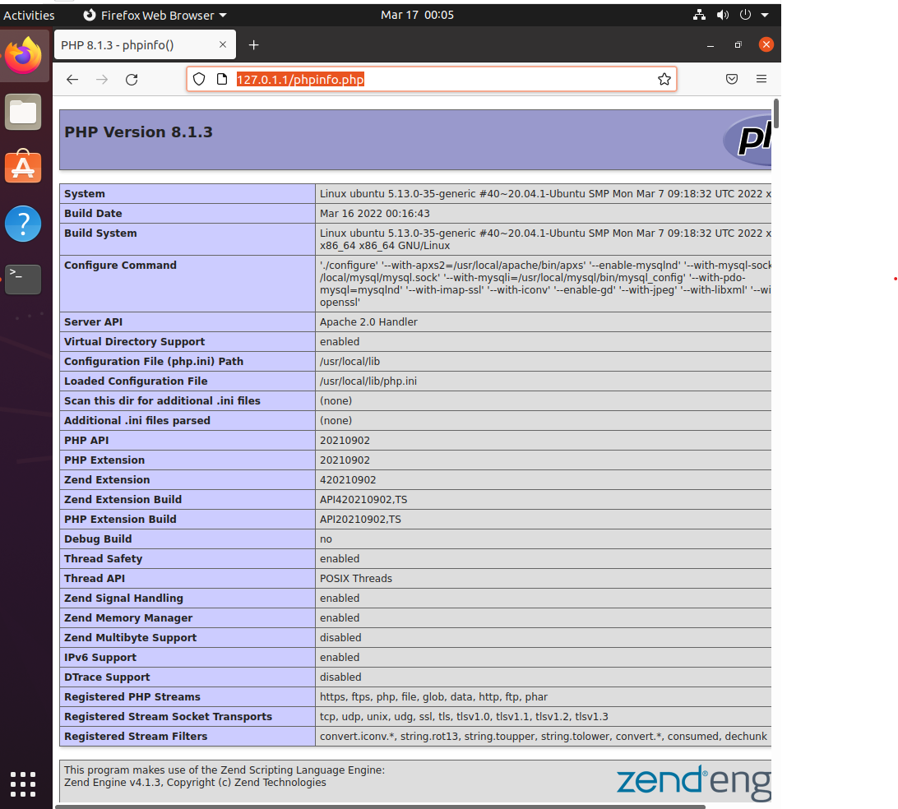

# [1htweek] APM 소스설치
> 환경: Ubuntu 64-bit 20.04 (RAM 4GB, Hardware 50GB), VMware Workstation 16.2.x, mysql 8.0.28, php 8.1.3, apr 1.7.0, apr-util 1.6.1  


## 최종결과물
  


## 이슈
- MYSQL 
    - CMAKE 중 하드웨어 용량이 부족하다는 에러 발생하여 기존 40GB->50GB로 변경하여 해결

- apache
    - apache 설치 과정서 pcre 다운시 ftp://ftp.pcre.org/pub/pcre/pcre-8.45.tar.gz 사용하면 호스팅 안된다는 에러 발생, 구글링 통해 더이상 해당 사이트에서는 서비스하지 않아 https://sourceforge.net/projects/pcre/files/pcre/8.45/pcre-8.45.tar.gz 의 주소로 wget하여 해결

    - ./configure 시의 에러
    ```
    error: Did not find pcre-config script at ~~ 
    ```
    해결: ./configure명령어에서 pcre-config 경로 수정
    ```
    --with-pcre=/usr/local/pcre/ #수정 전
    --with-pcre=/usr/local/pcre/bin/pcre-config #수정 후
    ```
