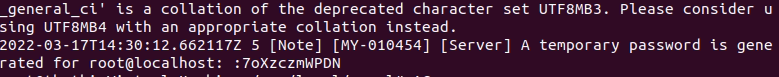
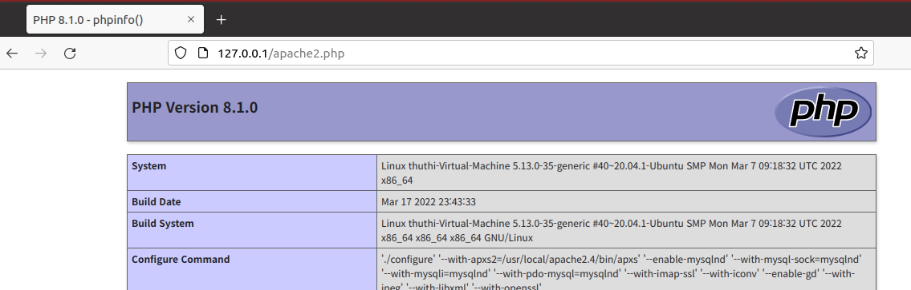

# 1주차

## 저는 ARM이 싫어요.

---

예전에 백업서버로 운영하던 arm에 apm을 설치한다고 고생했던 기억이 있어서 따로 우분투 설치를 하지 않으려고 했다.

고장 나기 전 까지는. 

스터디 진행 후 다시 한 번 부팅해보았으나 화면이 뜨지 않았고,

이 보드로 씨름을 해본 오랜 경험상 우분투를 재설치 해야한다. 

지금은 많이 나아졌겠지만 다시 arm보드로 뭘 설치한다고 생각하니 ptsd가 심하게 온다. 

## 저는 X86이 좋아요.

---

x86 윈도우 서버에 vm을 설치하려고 생각해보니 docker가 깔려 있어서 vm을 돌리지를 못 한다. 

따라서 hyper-v에 물려서 진행했다.

참고한 글은 [여기](https://yeni-days.tistory.com/2?category=1020921) 다.

리눅스 서버로 1년동안 씨름해본 경험이 있어서 명령어들은 어느정도 익숙해져 있어서 큰문제는 발생하지 않았다.

다만, mysql 설치 이후 발급받은 root 임시비밀번호를 아무리 입력해도 인증이 안 되길래 잘 보니

비밀번호가 `7oXzczmWPDN`이 아니라 `:7oXzczmWPDN` 다. 

진짜 너무한다.

## 저는 php가 싫어요.

---

싫어도 어쩔 수 없다.