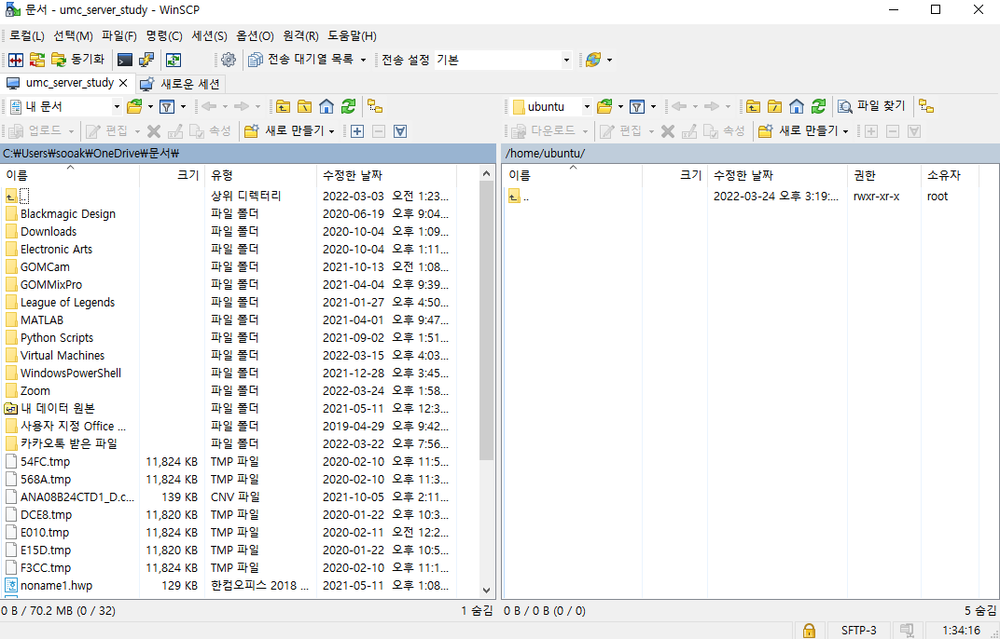

# [2ndweek] 포트포워딩, AWS 이용
> skbroadband 공유기, windows

## 이슈
- 포트포워딩
    - 해당 공유기의 경우 가상 ip주소를 할당 받아 생기는 문제가 있어 기존의 NAT 모드에서 bridge 모드로 변경하여 해결해야한다고 한다.
    - 기존의 가상 ip주소로 접속하면 접속되는 관리자 페이지와 다른 비밀번호를 사용하여 단자함을 찾아서 모뎀 후면에 적힌 것을 확인해야하나 여건상 불가능하여 중단

- AWS 인스턴스 생성 및 접속
    - putty 설치가 되어있지않아 오류가 발생하여 설치하여 해결

- 참고자료  
https://m.blog.naver.com/boy4lover/221817053037
https://paststory.tistory.com/211

## 결과물

