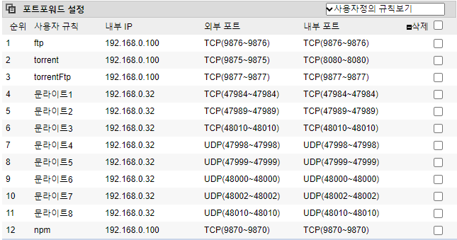

# 2주차

## 포트포워딩

## AWS

AWS 프리티어가 만료된데다가 얼마전에 계정이 해킹당해서 새로 계정을 생성했다.

생성에도 문제가 없고, 접속도 문제 없었으나, 다시 접속하려하니

이렇게 Permission이 너무 높아서 deny되었다는 에러가 떴다.

위 순서대로 진행하여 기존의 모든 권한을 삭제하고, 사용할 user의 rx권한만 줄 경우 윈도우에서도 정상적으로 접속이 가능했다.

