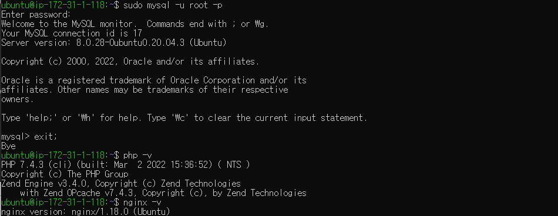

# 3주차

- 실습
    
    ## 패키지 설치
    
    
    
    nginx, php, mysql 모두 설정되었고, mysql 비밀번호도 정상적으로 설정되었다.
    
    ## nginx php 연동
    
    
    
    큰 문제 없이 nginx에서도 php를 호출할 수 있게 되었다.
    
    ## 도메인 적용
    
    서비스 런칭 시 가비아같은 상용 도메인 서비스 사용이 필수적이겠지만,  외의 목적에는 [내도메인.한국](http://내도메인.한국) 이나 [FreeNom](https://www.freenom.com/)을 사용해도 충분하다.
    
    내도메인.한국의 경우 한국에 서버를 두고 있기 때문에 빠르고, 제약이 전혀 없다는 장점이 있다. 그리고 도메인 유지 기간이 지나도 도메인 유지 기간 갱신이 가능하다. 가끔 서버가 다운된다는 얘기가 있고(한번도 겪지는 못 했다), 네임서버 설정같은 상세한 설정이 불가능하다. 
    
    FreeNom의 경우 가비아와 같이 네임서버 설정같은 상세 설정이 가능하지만, 외국에 서버를 두고 있어 사이트 자체가 접속이 약간 느리다. 그리고 유지조건이 90일간 25회이상의 접속, 유지기간 15일 전에 갱신을 해야한다는 단점이 있다. 그렇기 때문에 1~2달동안 진행되는 토이프로젝트 용도로는 적합하지 않다.
    
    
    
    thuthi.kro.kr를 쓰고 있기 때문에 thuthis.kro.kr로 하나 등록했고, 
    
    
    
    
    
    
    
    서브도메인과 리아디렉션도 모두 정상적으로 등록되었다.
    

## **🔥**챌린지 과제 HTTPS 적용

예전에는 https를 적용하려면 굉장히 복잡했는데 certbot이라는 python프로그램이 자동으로 등록해준다고 한다. ~~개발참쉬워졌다~~

처음에는 손으로 직접 적용했는데, 계속 접속이 안 되는 현상이 발생해서 [여기](https://twpower.github.io/44-set-free-https-by-using-letsencrypt)를 보고 cetbot으로 적용했다. 별 절차 없이 쉽게 되었는데도 불구하고 계속 접속이 안 되서 [알아보니](https://studyingpingu.tistory.com/23) 443포트가 닫혀있었다.  [포트열려있는지알아보는사이트](https://www.yougetsignal.com/tools/open-ports/)

`sudo certbot --nginx -d [thuthis.kro.kr](http://thuthis.kro.kr/) -d [www.thuthis.kro.kr](http://www.thuthis.kro.kr/) -d [dev.thuthis.kro.kr](http://dev.thuthis.kro.kr/) -d [prod.thuthis.kro.kr](http://prod.thuthis.kro.kr/)` 

명령어로 서브도메인까지 전부 적용했고, 

정상적으로 접속이 가능해졌다.