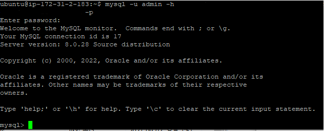
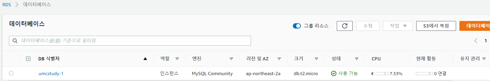
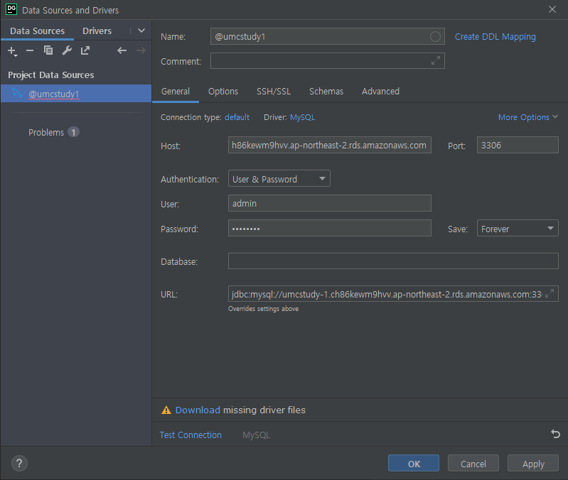
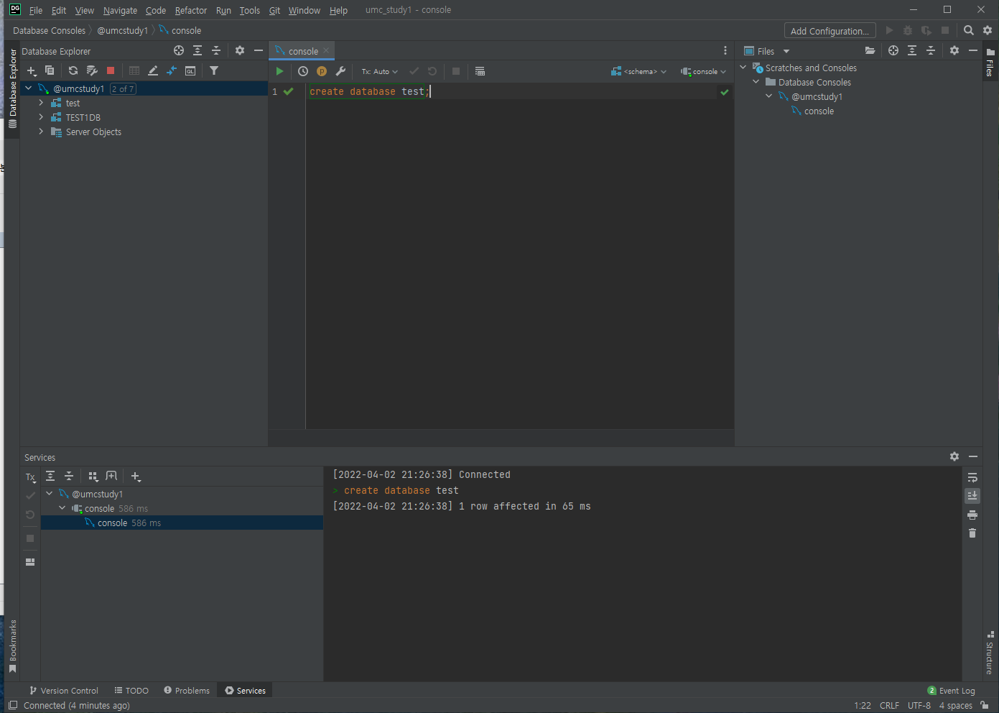

# [4thweek] DB 이론 및 설계
## RDBMS 이론
>DBMS: database Manage System  

- 논리 적용
entity객체: 'User'로 유저 닌네임 이름 프사 소개글 웹사이트 링크 묶기
attribute속성: User의 '닉네임 이름 프사 소개글...'
relative관계:

- 정규화: 중복을 최소화 하는 작업

- 물리(실제 dbms 구성 위한 작업)
entity>table
attribute>각 table의 column
relation > PK (primary key): 테이블의 대표값, 고유한 값 (사람의 주민등록번호, 게시물마다의 고유번호(식별위함))
		ex in IG: 유저라는 table > 닉네임 이름 소개글 +"유저인덱스"
		무조건 하나는 있어야함
	 FK (foreign key): 외래키
	join (쿼리용어임):

- 관계 (1:1 or 1:N or N:M)  
ex)IG
유저:게시물 = 1:N  
게시물:댓글 = 1:N  
유저:댓글 = 1:N

    책:작가 = N:M

## RDS 이론
>RDS: database server  

A서버 -DB  
B서버 -DB  > A,B 서버간 데이터 교류 불가

여러개의 서버가 하나의 DB공유하는 방식 > 이런 db의 예시가 RDS

## 과제
>AWS RDS구축, RDS 외부접속하기

  

RDS를 구축하고 인스턴스 내에서 접속을 성공했다.
테스트용으로 TEST1DB라는 이름의 db를 구축하였다.

구축한 해당 데이터베이스

데이터 그립에 구축한 RDS를 불러왔고

test라는 이름의 db를 임의로 생성해보았다. 왼쪽에 잘 생성된 것을 확인할 수 있다.  
  
### 참조
https://developer111.tistory.com/52  
https://velog.io/@janeljs/AWS-7  
https://velog.io/@nameunzz/AWS%EC%97%90%EC%84%9C-%EC%B4%88%EA%B8%B0%ED%99%98%EA%B2%BD-%EA%B5%AC%EC%B6%95%EA%B9%8C%EC%A7%80  
https://kimmjieun.tistory.com/28  
https://luminitworld.tistory.com/82
