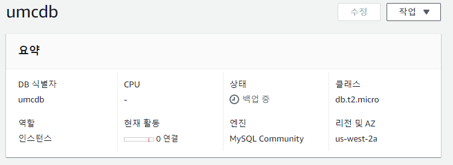

# 4주차

## RDS 생성

### RDS 생성

먼저, mysql rds를 생성해주었다.

### MYSQL port open

mysql default port인 3306포트를 오픈시켜준다.

### 외부 접속 허용

## DATAGRIP 연결

새 프로젝트를 생성하고, MYSQL을 선택하고 

db hostname과 rdb생성 시 설정한 user/pw를 넣어주면

이렇게 정상적으로 연결이 된다.