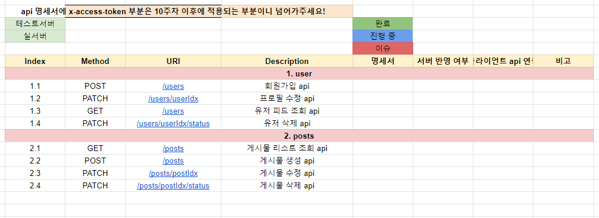

# 제목 없음

- 실습
    
    
    
    인스타를 하지 않아서 정확하게 listup할 수는 없지만, db 설계할 때 봤던 것으로 유추해보았을 때 아래와 같은 api를 추가로 제공해야할 것 같다.
    
    1. 팔로우
    2. 게시글 좋아요 추가
    3. 코멘트
    

# Update vs Insert / Delete

5주차 때 like와 follow, 게시물 등을 삭제할 때 delete하지 않고 update로 status를 마킹하는 식으로 하는 방식에 대해 의문을 가졌었다. 

status를 마킹하는 방식으로 구현할 경우 db사이즈가 비대해지고, 그럴수록 index유지에 시간이 오래 걸리므로 전체 성능이 낮아질 것으로 예상했다.

반대로 instnace를 delete하는 방식으로 구현할 경우 매번 disk에 접근해야하고, 매 delete/insert마다 index유지가 필요하므로 이 역시 성능 이슈가 발생할 수 있다.

어느 방식이 더 나은 방식일지 비교해보기 위해 더미데이터를 집어넣고 반응속도를 비교해보려고 한다.

## 1. 더미데이터

~~개인적으로 사용하고 있는 서버는 tb단위의 하드가 여러대 장착되어 있기 때문에 천억개 instance 까지도 무리없이 넣을 수 있지만 실습에 사용하는 rds는 20GB로, 1억개 넣기에도 부족하다.~~

~~그래서 User와 Follow에 각각 1천만개(10^7)개만 넣고 테스트 해보려고 한다. (실제로 10^7개만으로도 말도 안 되는 속도를 보여주기 때문에 본의아니게 적절한 사이즈가 됐다.)~~

~~처음에는 csv파일을 만들고, csv파일을 DataGrip으로 import하는 방식으로 진행했는데,~~

~~3만개 정도 처리하는데 2시간 30분이 걸리는 기염을 토하는 바람에 pymysql로 넣기로 했다.~~

### ~~User~~

~~어차피 Table에 PK외에는 인덱싱이 되어 있지 않기 때문에 랜덤성 없이 집어넣었다.~~

### ~~Follow~~

~~Follow의 경우는 User의 10배로 인 1억개(10^8)개를 넣으려 했으나, FK때문인지 IOPS제한에 걸려 진행이 불가능할 정도로 느려져서 “`1761604`"까지만 넣고 진행했다.~~

프리티어 RDS의 IOPS제한 때문에 Follow에 instane를 넣을 때 엄청난 성능저하가 발생했고, 자명하게 insert속도가 느려짐을 확인했다. 

개인 서버에서 테스트를 진행하면 IOPS제한이 널널하기 때문에 실제로 쿼리를 날리면서 비교해볼 수 있지만, 시간관계상 더 이상 진행하기는 무리라고 판단해서 멈추기로 했다.