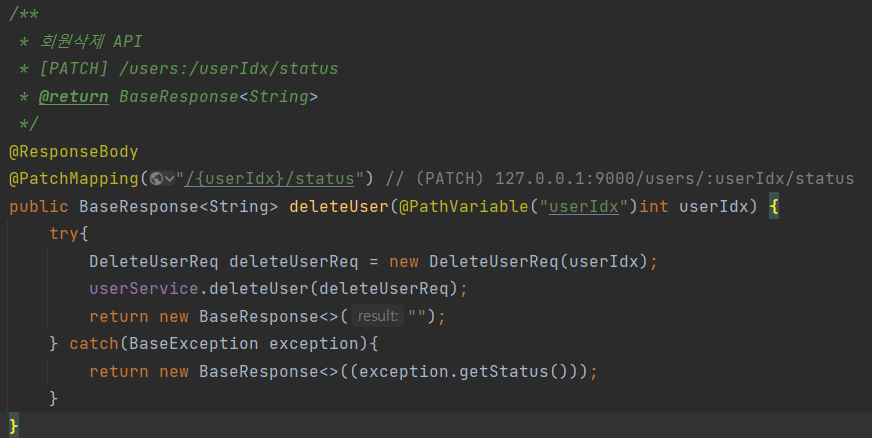
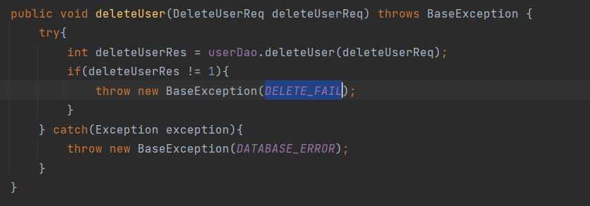
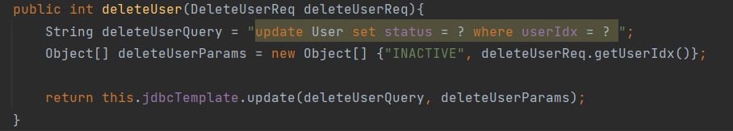
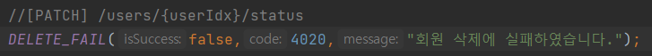
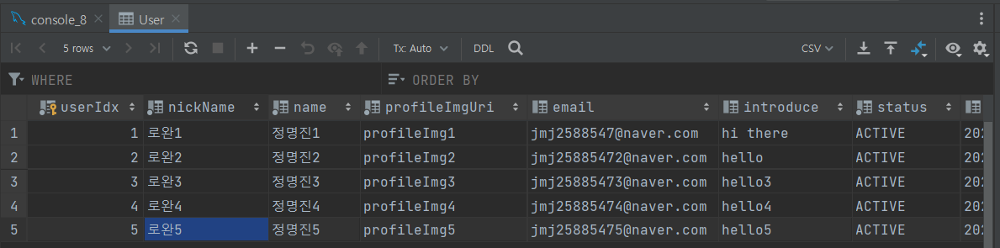
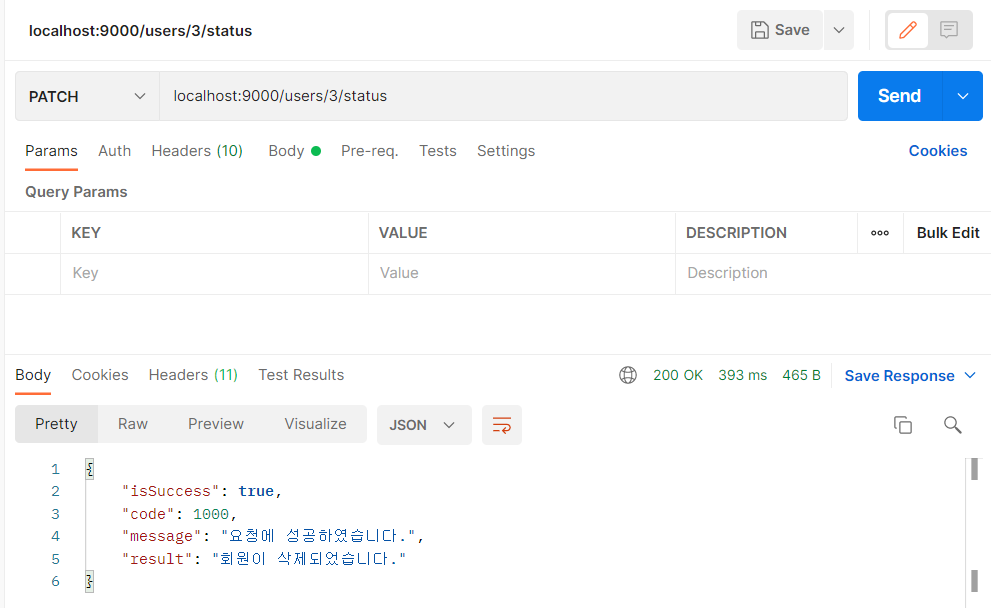
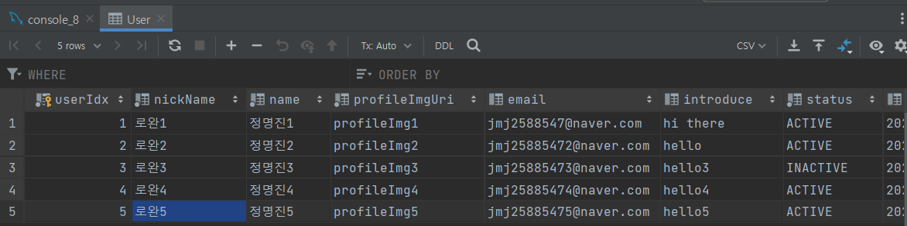
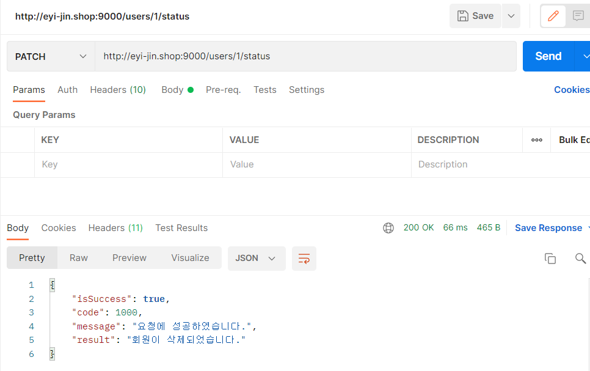
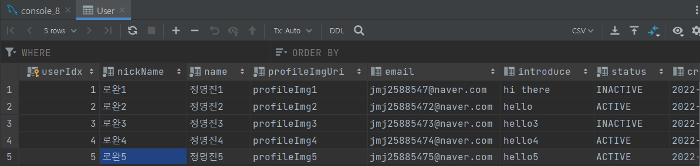

# delete API 구현하기

> API를 구현하기 위해서는 Controller, Service(조회 이외의 다른 역할),Dao를 수정해줘야 한다.  템플릿 코드를 수정해가면서 완성해보자!
> 

- UserController.java



```java
/**
 *회원삭제API
 * [PATCH] /users:/userIdx/status
 *@returnBaseResponse<String>
*/

@ResponseBody
@PatchMapping("/{userIdx}/status") // (PATCH) 127.0.0.1:9000/users/:userIdx/status
public BaseResponse<String> deleteUser(@PathVariable("userIdx")int userIdx) {
    try{
        DeleteUserReq deleteUserReq = new DeleteUserReq(userIdx);
        userService.deleteUser(deleteUserReq);
        return new BaseResponse<>("");
    } catch(BaseException exception){
        return new BaseResponse<>((exception.getStatus()));
    }
}
```

- UserService.java

```java
public void deleteUser(DeleteUserReq deleteUserReq) throws BaseException {
        try{
            int deleteUserRes = userDao.deleteUser(deleteUserReq);
            if(deleteUserRes != 1){
                throw new BaseException(DELETE_FAIL);
            }
        } catch(Exception exception){
            throw new BaseException(DATABASE_ERROR);
        }
    }
```



- UserDao.java

```java
public int deleteUser(DeleteUserReq deleteUserReq){
        String deleteUserQuery = "update User set status = ? where userIdx = ? ";
        Object[] deleteUserParams = new Object[] {"INACTIVE", deleteUserReq.getUserIdx()};

        return this.jdbcTemplate.update(deleteUserQuery, deleteUserParams);
    }
```



- BaseResponseStatus.java

```java
//[PATCH] /users/{userIdx}/status
    DELETE_FAIL(false,4020,"회원 삭제에 실패하였습니다.");
```



# Datagrip과 Postman으로 로컬에서 DB확인

### 삭제 전



### Postman으로 로컬에서 삭제 테스트

로완3을 삭제시켜보자!



### 삭제후

로완3의 status가 INACTIVE로 바뀌었음을 볼 수 있다.



# Datagrip과 Postman으로 EC2에서 DB확인

먼저, 로컬의 파일을 EC2로 전송해준다.

[로컬 파일 EC2로 전송](https://canary-dianella-2bf.notion.site/EC2-099ad733c79d433ebf40a434ebf7a3bb)

### 1. 옮긴 .jar 파일을 실행한다.

```bash
java -jar demo-0.0.1-SNAPSHOT.jar
```

### 2. postman으로 확인해본다.

이번에는 회원 1을 회원 삭제 상태로 만들어보자!



### 3. Datagrip을 통해서 확인해보기

아래의 사진에서 로완1도 INACTIVE상태가 된 것을 볼 수 있다.

