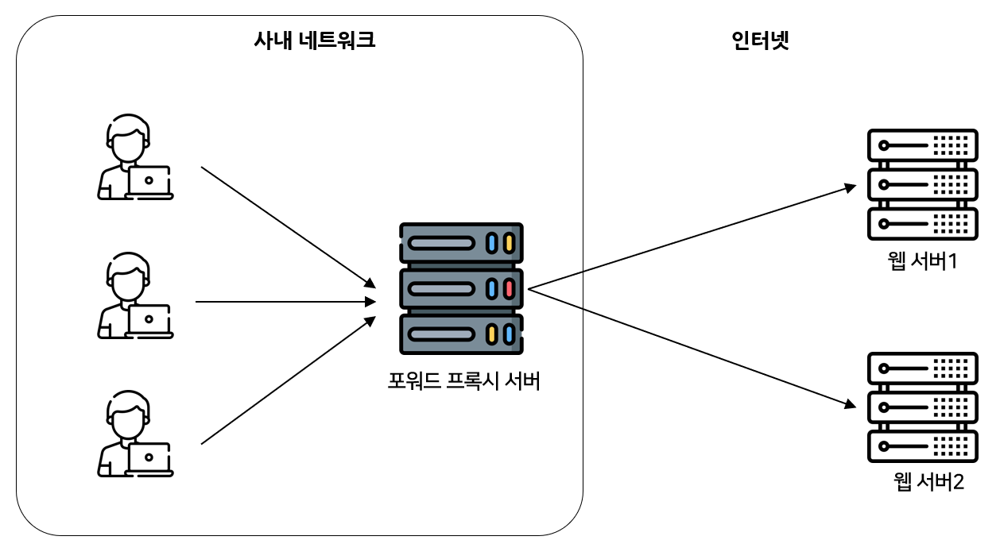

# 7주차

## 실습

### Nginx

사실 Spring에서 자체적으로 톰캣을 내장하고 있기 때문에 Nginx 없이도 배포가 가능하다. 당장 local에서 작업할 때 [localhost](http://localhost):9000 으로 접속 시 정상적으로 접속이 되기 때문에 외부 포트만 열어주면 외부에서 접근 가능하다는 것을 알 수 있다.

그럼 Nginx를 왜 쓰느냐? 이유로는 ReverseProxy, 무중단 배포, 로드밸런싱이 있다. 

1. **ReverseProxy**

프록시 서버는 크게 포워드 프록시, 리버스 프록시가 존재한다. 



포워드 프록시

포워드 프록시의 경우 사내 네트워크에서 Client가 위부 Server와 직접 통신하지 못 하도록 막는 목적으로 사용된다. 예를 들어, 학교 와이파이로 접속 시 특정 사이트로 접속 못 하도록 한다거나, 서버로 부터 어떤 사용자가 접근 했는지 알아낼 수 없도록 할 때 쓰인다. Client의 request가 프록시 서버로 모두 모이게 되고, 다시 프록시 서버가 Server로 request를 전달 하기 때문에 request를 막아버린다거나 IP추적이 불가능하도록 만들 수 있다.


리버스 프록시

반면, 리버스 프록시는 Client가 사내 Server와 직접 통산하지 못 하도록 막는 목적으로 사용된다. 예를 들어, 리버스 프록시 서버의 IP는 노출 될 지라도, 실제 웹 서버의 IP는 노출되지 않도록 할 수 있고, SSL 암/복호화의 부담을 줄일 수 있다. 프록시 서버에서 암호화/복호화를 모두 처리하기 때문이다. 

강의에서 proxy_pass를 사용해준 것이 reverse proxy부분으로, https요청을 통해 443포트로 들어온 요청을 localhost:9000으로 다시 보내줌을 알 수 있다.


강의에서 https로 진행해라고 얘기했었는데, reverse proxy를 설정하지 않은 경우 접속이 되지 않는 것을 알 수 있다. 강의에서는 SpringBoot 내부의 Tomcat이 https요청을 받을 수 있도록 설정하지 않았기 때문에 https로 요청 시 복호화를 진행하지 않아 정상적으로 http request header를 파싱할 수 없다는 것을 알 수 있다. 

해결 방법은 2가지가 있는데, Tomcat이 https를 받을 수 있도록 설정해주거나, 강의에서와 같이 reverse proxy를 사용하여 nginx가 복호화해서 SpringBoot로 http로 던져줄 수 있도록 해주면 된다.

1. **무중단 배포**

말 그대로 배포 시 서버를 중단하지 않고 배포하기 위한 방법이다. nginx reload 명령어를 통해 이런식으로 배포할 경우 거의 무중단으로 배포할 수 있다고 한다.


1. **로드밸런싱**

Nginx에서 제공하는 reverse proxy로 성능은 낮지만 기본적인 로드밸런싱이 가능하다.


### AWS EC2 스왑설정

Spring build시 Cpu 사용량이 100%를 찍고, ssh에서 타이핑이 되지 않을 정도로 부하가 걸리길래 검색해보니 EC2에서는 기본적으로 스왑이 설정되어 있지 않아서 램1GB로 돌리기 때문에 Spring 빌드가 사실상 불가능하다고 한다.

```sql
$ sudo dd if=/dev/zero of=/swapfile bs=128M count=16
$ sudo chmod 600 /swapfile
$ sudo mkswap /swapfile
$ sudo swapon /swapfile
$ sudo vi /etc/fstab
파일 끝에 
/swapfile swap swap defaults 0 0
추가
```

위 명령어를 순서대로 설정하면 2GB의 스왑이 설정된다. 확실히 JVM돌리기에는 프리티어 서버 성능이 부족한 것 같다.

### @Autowired

Autowired Annotation은 의존성 주입(DI)을 위해 쓰이는 어노테이션이다. 

- 의존성 주입
    
    말 그대로 Class가 다른 Class에 의존하는 경우 의존성이 있다고 한다.
    
    ```java
    public Class B1 extends B;
    public Class B2 extends B;
    
    public Class A {
    	private B b;
    	public A() {
    		this.b = new B1();
    		//this.b = new B2();
    	}
    	public run() {
    		b.run();
    	}
    }
    ```
    
    ```java
    public Class B1 extends B;
    public Class B2 extends B;
    
    public Class A {
    	private B b;
    
    	public A(B b) {
    		this.b = b;
    	}
    	public run() {
    		b.run();
    	}
    }
    ```
    
    의존성 “주입”을 프로그램 관점에서 보면, A가 B1에 의존할 지 B2에 의존할 지 정적타임이 아니라 동적타임에 결정된다. ⇒ 결합도를 낮추고, 유연성이 증가.
    

의존성 주입의 단점으로는, 어쨋든 객체를 런타임에 생성하고, 소멸시키기 때문에 가비지 컬렉터의 부담이 생김.

⇒ Spring에서는 객체들을 직접 관리하며 생명주기를 컨트롤 함(Spring에서 관리하는 객체를 Bean이라 부름). 싱글톤으로 등록시켜서 가비지 컬렉터의 부담을 줄여줌.

⇒ Bean이 되도록 등록하는 Annotation이 @Controller, @Service, @Repository

⇒ Bean으로 등록된 Class앞에 @Autowired를 붙혀주면 Bean들 사이에 의존성 주입을 해줌.


Field Injection


Constructor Injection

Field Injection은 “절대” 쓰면 안 되는 방식. ⇒ Test가 불가능

Setter Injection은 주입받는 객체가 동적으로 변할 때 사용함. ⇒ 실무에서 사용할 일이 평생중에 1번있을까 말까

따라서, Constructor Injection을 권장

- Controller, Service, Repository외의 다른 Java Class를 넣고 싶거나, 객체가 변할 가능성이 있는 경우 따로 Configuration에서 Bean을 등록할 수 있음. ⇒ 할 줄 알아야 함.

## 🔥챌린지 과제


Controller


Service


Dao


### Exception처리 추가

- 문제


- 해결


Dao


Provider

- 결과

