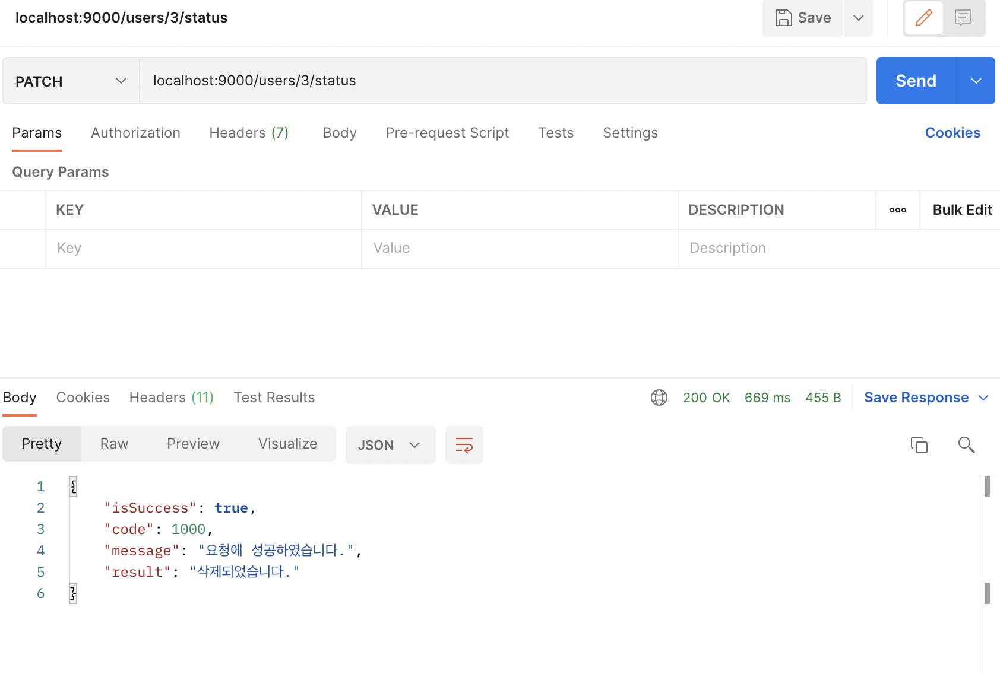

# 6주차 챌린지 과제
Notion설명: [Notion](https://www.notion.so/6-895182aba4654712a976b1a5c04a867a)
=================================
## 유저 삭제 API만들기(PATCH 메소드 사용)

```java
//UserController.java
@ResponseBody
    @PatchMapping("/{userIdx}/status") // (PATCH) 127.0.0.1:9000/users/:userIdx/status
    public BaseResponse<String> deleteUser(@PathVariable("userIdx") int userIdx){
        try {
            DeleteUserReq deleteUserReq = new DeleteUserReq(userIdx);
            userService.deleteUser(deleteUserReq);

            String result = "삭제되었습니다.";
            return new BaseResponse<>(result);
        } catch (BaseException exception) {
            return new BaseResponse<>((exception.getStatus()));
        }
    }
```

```java
//UserService.java
public void deleteUser(DeleteUserReq deleteUserReq) throws BaseException {
        try{
            int result = userDao.deleteUser(deleteUserReq);
            if(result == 0){
                throw new BaseException(USERS_EMPTY_USER_ID);
            }
        } catch(Exception exception){
            throw new BaseException(DATABASE_ERROR);
        }
    }
```

```java
//UserDao.java
public int deleteUser(DeleteUserReq deleteUserReq){
        String deleteUserQuery = "update User set status = ? where userIdx = ? ";
        Object[] deleteUserParams = new Object[]{"DELETE", deleteUserReq.getUserIdx()};

        return this.jdbcTemplate.update(deleteUserQuery,deleteUserParams);
    }
```




EC2로 파일을 옮기고 나서도 실행시켜봤다.


https에서되도록 하고싶은데 어떻게 해야하는지 모르겠다. 노드 강좌에서는 https 적용시키는 게 나오지만 자바 스프링 강좌는 생략해버렸다.

---

# 여담

### 1. DeleteUserRes.java는 왜 있는지 모르겠다.

### 2. 강의의 진행순서가 이상하다. 
Spring Boot파트이신분은 7주차 영상을 반대로 보면 될 것 같다.

### 3. DB설계할 때 제대로 이름을 연동되게 만들어놓지 않아 강의에선 그냥 실행하면 동작할 것처럼 해놨지만, 실제로는 User 테이블의 website 필드를 email로 바꿔줘야 동작한다. 혹은 Java코드에서 email관련을 전부 website로 바꿔주던가...

추가로 email을 5주차 DB제작에서 이야기를 했는지 확인해보려 다시 들었지만, 아무말없이 은근슬쩍 email필드가 추가되어있는 것을 확인할 수 있었다.