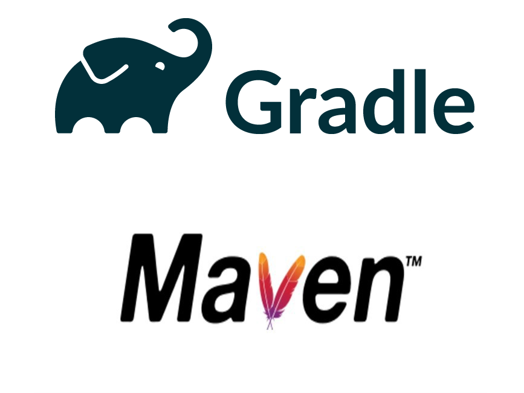

# 발표

# 준비하게 된 계기

> 우연하게 보게 된 Naver D2 News!!
> 


```bash
./gradlew clean build
```

# 빌드도구



> 소스코드에서 **실행** 가능한 **어플리케이션**으로 **자동 생성**하는 프로그램
> 
- **빌드**는 코드를 사용 or 실행 가능한 형태로 **컴파일링**, **링킹**, **패키징** 하는 것을 포함한다.
    - 컴파일링: 소스코드를 컴파일러를 통해 이진 코드로 변환
    - 링킹: 컴파일된 파일 간에 연결관계를 지어주는 과정
    - 패키징: dll, jar, war, exe 같이 배포 및 실행 가능한 형태로 압축하는 것
- **빌드 자동화**는 간단히 말해 **빌드작업**을 **스크립팅**하거나 **자동화** 하는 행위
    1. 종속성 다운로드
    2. 소스코드를 바이너리코드로 컴파일
    3. 바이너리 코드를 패키징
    4. 테스트 실행
    5. 프로덕션 시스템에 배포


💡 **스프링 부트 프로젝트**를 생성할 때 빌드 툴을 **Maven과 Gradle** 중에 **선택**할 수 있습니다.


# 사용이유

- 대규모 프로젝트에선 **무엇을 빌드**할지, 어떤 **순서**로 할지, 어떤 **의존성**이 있는지 모두 추적하기 쉽지 않기 때문이다. ⇒ **빌드도구**를 사용하면 이를 일관되게 할 수 있다.

# 빌드도구의 흐름

### 1세대 원조 빌드 툴 Make (Makefile)

- 빌드 개념을 확립
- Unix 계열 OS에서 사용
- C언어로 개발된 소프트웨어를 빌드할 때는 아직도 make 사용
- make clean

### 2세대 자바를 위한 빌드 툴 Ant (build.xml)

- Make를 java에 적용하려다보니 문제, 보완하기 위해 탄생
- Java + XML 도입 → 플랫폼 의존 문제 해결
- 약간만 복잡한 처리를 하려고 하면 빌드 스크립트가 장황해짐

### 3세대 빌드 툴의 혁명 Maven (pom.xml)

- 작성 효율을 높임
- 빌드 생명주기(lifecycle)와 프로젝트 객체모델(POM)개념을 도입 
→ Ant의 문제점인 장황한 빌드스크립트 문제를 해결
- 기능이 많아서 사용이 어려워짐

### 4세대 Gradle (build.gradle)

- 지금까지 빌드 툴이 가진 장점, 생태계 활용, 약점은 제거
- Maven보다 빠름
- 기존 Maven 등 다른 빌드도구와 호환 가능
- 현재 안드로이드 스튜디오의 공식 빌드 시스템

# Gradle(그래들)

### Gradle관련 파일들의 구조

```
├─ gradle

│       └─ wrapper

│       ├─ gradle-wrapper.jar

│       └─ gradle-wrapper.properties

├─ gradlew

├─ gradlew.bat

├─ build.gradle

└─ settings.gradle
```

- gradlew: **리눅스** 또는 **맥OS**용 실행 **쉘 스크립트** 파일
- gradlew.bat: **윈도우**용 실행 **배치 스크립트** 파일
- gradle-wrapper.jar: **JAR 형식으로 압축**된 **Wrapper** 파일. gradlew나 gradlew.bat 파일이 Gradle task를 실행하는데 사용됨.
- gradle-wrapper.properties: Gradle Wrapper **설정 정보 파일**. Wrapper의 버전 등을 설정할 수 있음.
- build.gradle: **프로젝트 내용**에 관한 설정하는 파일
- settings.gradle: 프로젝트의 **구성 정보 파일**. 멀티 프로젝트를 구성시 프로젝트를 모듈화할 경우, 하위 프로젝트의 구성을 설정할 수 있음.

### 초급자 수준에서 **build.gradle**파일 외에는 수정할 일이 없다.

# Gradle VS Maven

|  | Gradle | Maven |
| --- | --- | --- |
| 길이 | 더 짧다 |  |
| 속도 | 더 빠르다 |  |

# 질문

### Q1. ****make와 gcc, g++의 차이점은 무엇인가요?****

- **'gcc'**는 **컴파일러**입니다. 실제로 소스 코드를 **실행 파일로 바꾸**는 프로그램입니다. 소스 코드의 위치, 출력 할 내용 및 라이브러리 및 옵션과 같은 다양한 기타 정보를 말해야합니다.
    - gcc 이용 빌드 과정 (main.c , f1.c, f2.c, f1.h, f2.h 가 있다고 가정)
    **컴파일:** `$ gcc -c main.c f1.c f2.c` → **컴파일** 하여 **오브젝트 파일**을 생성
    **링킹:** `$ gcc main.o f1.o f2.o` →  **오브젝트 파일**들을 하나로 **연결**시킨 **실행파일**을 생성
    **실행:** `$ ./a.out`
- **'make'**는 프로그램 **컴파일을위한 스크립팅 언어**와 비슷합니다. 이것은 소스를 컴파일하는 모든 세부 사항 (컴파일러를 넘겨야하는 모든 인수)을 숨기는 방법입니다. 
위의 모든 세부 사항을 Makefile에서 한 번 스크립트하므로 **모든 파일마다 매번 입력 할 필요가 없습**니다.
    - make 이용 빌드 과정
    **makefile 작성** :  빌드 설정이 들어있는 파일
        
        ```makefile
        f1.o : f1.h f1.c
        	gcc -c f1.c
        
        f2.o : f2.h f2.c
        	gcc -c f2.c
        
        main.o : main.c f1.h f2.h
        	gcc -c main.c
        
        main : f1.o f2.o main.o
        	gcc f1.o f2.o main.o
        ```
        
        **빌드:** `$ make main` → make 명령을 통해 빌드하면 **컴파일 + 링킹**이 그대로 실행
        

### 참고 make가 아닌 gcc로 빌드하기위한 과정

# 참고

 **[백엔드 개발자를 꿈꾸는 학생개발자에게](https://d2.naver.com/news/3435170)**

 [**빌드도구란?**](https://wangmin.tistory.com/50#:~:text=%EB%B9%8C%EB%93%9C%EB%8F%84%EA%B5%AC%EB%8A%94%20%EC%86%8C%EC%8A%A4%EC%BD%94%EB%93%9C,%ED%95%98%EA%B1%B0%EB%82%98%20%EC%9E%90%EB%8F%99%ED%99%94%20%ED%95%98%EB%8A%94%20%ED%96%89%EC%9C%84%EC%9D%B4%EB%8B%A4.)

 **[빌드도구란(Build Tool)](https://galid1.tistory.com/194)**

 **[빌드툴(Build Tool)](https://starrykss.tistory.com/276)**

 [**make와 makefile**](https://bowbowbow.tistory.com/12)

 ****[스프링에서 Gradle과 build.gradle코드의 의미](https://velog.io/@smallcherry/Spring-%EC%8A%A4%ED%94%84%EB%A7%81%EC%97%90%EC%84%9C-Gradle%EA%B3%BC-build.gradle%EC%BD%94%EB%93%9C%EC%9D%98-%EC%9D%98%EB%AF%B8)****

 **[Makefile 이란 ? gcc, g++과 makefile의 차이? 변수 설정](https://infinitt.tistory.com/315)**