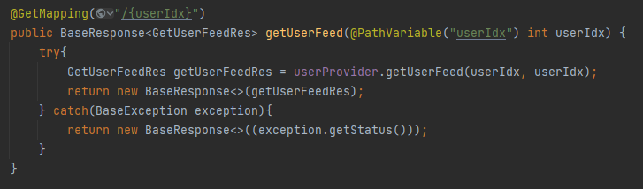

# 8주차

# 실습

---

## 1. 유저 피드 조회 api



UserController


UserProvider


UserDao

Dao의 getUserPostsInfo 쿼리문 수정

```sql
SELECT p.postIdx as postIdx, pi.imgUrl as imgUrl
FROM Post as p
         join PostImgUrl as pi on p.postIdx = pi.postIdx and pi.status = 'ACTIVE'
         join User as u on p.userIdx = u.userIdx
WHERE p.status = 'ACTIVE' and u.userIdx = ?
GROUP BY p.postIdx
HAVING min(pi.postImgIdx)
ORDER BY p.postIdx;
```


전 Result

```sql
SELECT p.postIdx as postIdx, pi.imgUrl as imgUrl
FROM Post as p
         join PostImgUrl as pi on p.postIdx = pi.postIdx and pi.status = 'ACTIVE'
         join User as u on p.userIdx = u.userIdx
WHERE p.status = 'ACTIVE' and u.userIdx = 
GROUP BY p.postIdx
HAVING min(pi.postImgIdx)
ORDER BY p.postIdx DESC;
```


후 Result

최신 게시물이 앞으로 노출되어야 하므로 postIdx기준 내림차순으로 정렬해줌.

## 2. 게시물 조회 api

- 게시물 조회 시 해당 사용자의 모든 게시물을 조회함

→ 앱에서는 합리적임.

→ 하지만 웹에서는 클릭 시 하나의 게시물만 조회하게 됨 

→ 모든 게시물을 조회하는 api와 하나의 특정 게시물만 조회하는 api를 분리할 필요가 있어보임.

- 사용자의 게시물이 너무 많은 경우 모든 게시물을 다 전달할 경우 서버 성능 이슈가 있을 수 있고, 클라이언트 측면에서도 지나친 메모리 사용과 데이터 사용 문제가 발생할 수 있음

→ 클라이언트와 합의해서 특정 개수(10개 정도)만 가져올 수 있도록하고, lazy하게 받아오도록 하는 것이 합리적임.

→ 실제 인스타에서도 10개정도의 게시물만 불러오고, 스크롤 내리면 로딩을 다시 하도록 구현 됨.

→ 어느 게시물부터 조회하는지에 대한 정보도 필요하고, 따라서 쿼리문이 더 복잡해짐.

- 강의에서 예제로 사용한 Query는 문제가 많음.
1. **논리적 오류**

```sql
SELECT
    p.postIdx as postIdx,
    u.userIdx as userIdx,
    u.nickname as nickname,
    u.profileUrl as profileUrl,
    p.content as content,
    IF(postLikeCount is null, 0, postLikeCount) as postLikeCount,
    IF(commentCount is null, 0, commentCount) as commentCount,
    case
        when timestampdiff(second, p.updatedAt, current_timestamp) < 60 then concat(timestampdiff(second, p.updatedAt, current_timestamp), '초 전')
        when timestampdiff(minute, p.updatedAt, current_timestamp) < 60 then concat(timestampdiff(minute, p.updatedAt, current_timestamp), '분 전')
        when timestampdiff(hour, p.updatedAt, current_timestamp) < 24 then concat(timestampdiff(hour, p.updatedAt, current_timestamp), '시간 전')
        when timestampdiff(day, p.updatedAt, current_timestamp) < 365 then concat(timestampdiff(day, p.updatedAt, current_timestamp), '일 전')
        else timestampdiff(year, p.updatedAt, current_timestamp)
    end as updatedAt,
    IF (pl.status = 'ACTIVE', 'Y', 'N') as likeOrNot
FROM Post as p
         join User as u on u.userIdx = p.userIdx
         left join (select postIdx, userIdx, count(postIdx) as postLikeCount from PostLike) as ppl on ppl.postIdx = p.postIdx and ppl.userIdx = u.userIdx
         left join (select postIdx, count(commentIdx) as commentCount from Comment WHERE status = 'ACTIVE') as cco on cco.postIdx = p.postIdx
         left join (Follow as f) on f.followIdx = p.userIdx and f.status = 'ACTIVE'
         left join (PostLike as pl) on pl.userIdx = f.followerIdx and pl.postIdx = p.postIdx
WHERE f.followerIdx = ? and p.status = 'ACTIVE'
GROUP BY p.postIdx;
```


**문제**: 1이 3의 게시물을 조회하려할 때 followerIdx = 3가 되므로 3이 팔로우한 사용자의 게시물이 나오게 됨.

**해결:** f.followerIdx = ? → f.followeeIdx = ?

1. **말도 안 되게 느림.**


기존 Query 시간

문제는 게시글마다 하나하나 imgUrl를 가져오기 때문에 게시물이 많을 수록 오래걸림.

어떻게 해결하면 좋을지 여러 고민을 해봄.

~~imgUrl을 받아와야할 postIdx를 모아서 한꺼번에 sql in연산자로 query를 날려서 db access횟수를 1회로 줄여버리고 서버단에서 처리해주기. → 유일한 해결책이 아닌가?~~

# N + 1 Problem

---


1. **SQL로 해결하기**

```sql
SELECT postList.*, pi.imgUrl, pi.postImgIdx
FROM (SELECT
	    p.postIdx as postIdx,
	    u.userIdx as userIdx,
	    u.nickname as nickname,
	    u.profileUrl as profileUrl,
	    p.content as content,
	    IF(postLikeCount is null, 0, postLikeCount) as postLikeCount,
	    IF(commentCount is null, 0, commentCount) as commentCount,
	    case
	        when timestampdiff(second, p.updatedAt, current_timestamp) < 60 then concat(timestampdiff(second, p.updatedAt, current_timestamp), '초 전')
	        when timestampdiff(minute, p.updatedAt, current_timestamp) < 60 then concat(timestampdiff(minute, p.updatedAt, current_timestamp), '분 전')
	        when timestampdiff(hour, p.updatedAt, current_timestamp) < 24 then concat(timestampdiff(hour, p.updatedAt, current_timestamp), '시간 전')
	        when timestampdiff(day, p.updatedAt, current_timestamp) < 365 then concat(timestampdiff(day, p.updatedAt, current_timestamp), '일 전')
	        else timestampdiff(year, p.updatedAt, current_timestamp)
	        end as updatedAt,
	    IF (pl.status = 'ACTIVE', 'Y', 'N') as likeOrNot
	FROM Post as p
	         join User as u on u.userIdx = p.userIdx
	         left join (select postIdx, userIdx, count(postIdx) as postLikeCount from PostLike) as ppl on ppl.postIdx = p.postIdx and ppl.userIdx = u.userIdx
	         left join (select postIdx, count(commentIdx) as commentCount from Comment WHERE status = 'ACTIVE') as cco on cco.postIdx = p.postIdx
	         left join (Follow as f) on f.followIdx = p.userIdx and f.status = 'ACTIVE'
	         left join (PostLike as pl) on pl.userIdx = f.followerIdx and pl.postIdx = p.postIdx
	WHERE f.followIdx = ? and p.status = 'ACTIVE'
	GROUP BY p.postIdx) as postList
left join PostImgUrl as pi on postList.postIdx = pi.postIdx and pi.status = 'ACTIVE';
```


수정 전 쿼리 결과


수정 후 쿼리 결과

동일한 쿼리를 훨씬 더 빠르게 처리 가능하나, 이렇게 만드는 작업이 굉장히 까다로움.(SQL문 검증, null이나 empty처리, HashMap으로 모아서 List로 반환해줘야하는 작업 등등)

1. **ORM사용하기**

Object Relational Mapping → Java의 Object와 Relational DB를 자동으로 매핑해주는 자바의 공식적인 인터페이스, API.

| JDBC | Mybatis | JPA | Hibernate |
| --- | --- | --- | --- |
| 직접 SQL문을 날리고, 
모두 관리해야함. 
DB가 바뀌면 SQL문을 모두 바꿔야함.
DB의 TABLE과 JAVA의 CLASS를 직접 매핑시켜줘야함. | JDBC 업그레이드버전  | DB종류와 무관하게 쿼리를 날릴 수 있게 정의된 자바진영의 API. API명세만 정의됨. | JPA에 정의된 API들을 구현한 구현체 중 하나. OpenJPA 등 다른 구현체도 있으나, 요즘은 전부 Hibernate사용 |

ORM을 통해서 

1. 이미지를 아예 안 불러온다거나, 
2. 아예 다 불러온다거나, 
3. 나중에 필요할 때 불러온다거나, 
4. 명령어 하나로 위 SQL과 같이 자동으로 join해준다거나, 
5. 그냥 내가 SQL문을 던져준다거나 

모두 가능.

[반드시 JPA를 사용해야하는 또 다른 이유](https://bros.tistory.com/11)