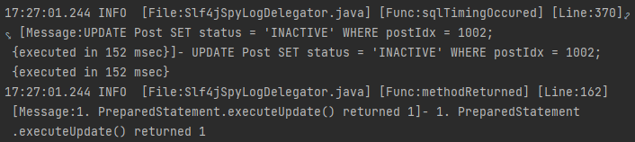

# Notion
https://thuthi.notion.site/UMC-80d96c1f1f3d422ab2f7b80c2322f93f

# 9주차

# 실습

그냥... 잘 따라했다.(posts post, patch, delete)

## log4jdbc

중간에 sql문 query하는데 문제가 생겨서 디버깅 해보려 했으나, 실제로 어떻게 sql문이 던져지는지 알 방법이 없음.

→ log4jdbc 패키지를 사용해서 sql문이 실제로 어떻게 날라가는지, 어떤 값을 return하는지 알 수 있음.

**build.gradle**

```cpp
compile ('com.googlecode.log4jdbc:log4jdbc:1.2')
```

**application.yml**

```json
~~url: jdbc:mysql://~~
url: jdbc:log4jdbc:mysql://

~~driver-class-name: com.mysql.cj.jdbc.Driver~~
driver-class-name: net.sf.log4jdbc.DriverSpy
```

**logback-spring.xml**

```json
<logger name="jdbc.sqlonly" level="DEBUG"/>
```

를 모두 추가



# SQL 쿼리 속도 비교(망)

status를 두고 ACTIVE와 INACTIVE로 하기 vs 그냥 DELETE하기

## Test용 DB 스펙

OS: **Ubuntu 20.04.4 LTS**

Kernel: **Linux 5.17.4-051704-generic**

DB: **MySQL 8.0.29-0ubuntu0.20.04.3**

User: 5,000,000개

Follow: 20,000,000개

Post: 20,000,000개

PostLike: 100,000,000개

PostImgUrl: 100,000,000개

Comment: 100,000,000개

~~CommentLike: 500,000,000개~~

모든 문자열 랜덤, FK랜덤, ACTIVE상태.

Post 데이터 까지 넣는데만 3시간이 넘게 걸림.(잘 못 넣어서 삭제하는데만 15분)

### 성능 최적화

[Bulk Insert](https://dev.dwer.kr/2020/04/mysql-bulk-inserting.html)

```sql
mysql> SET unique_checks=0;
mysql> SET foreign_key_checks=0;
Bulk Inserting......
mysql> SET unique_checks=1;
mysql> SET foreign_key_checks=1;
```


# 순수 JPA 공부

## JPA 구조

---


요청이 들어올 때 마다 emf를 통해 em을 생성하고, em은 내부적으로 database connection을 사용하여 DB에 접근함.


요청이 올 때마다 생성된다고 하지만, Spring에서는 EntityManager가 bean으로 등록되어 singletone패턴이 적용되기 때문에 하나밖에 존재할 수 없다.

Spring에서는 어떻게 동작하는지 (factory에서 직접 생성해서 db에 concurrent하게 접근할 수 있다던가) 조금 더 공부 해봐야함.

## 모든 테이블 JPA로 매핑하기

---


테이블 다이어그램

### User


```java
@Table(name = "Users")
public class User {
    private Long userIdx;
    private String name;
    private String nickName;
    private String phone;
    private String email;
    private String password;
}
```

```java
@Entity
public class User extends DateBaseEntity{
    @Id @GeneratedValue
    private int userIdx;

    // @Column(length = 45, nullable = false) 너무 난잡해져서 생략. default : 255, true
    private String nickname;
    private String name;
    private String profileUrl;
    private String websiteUrl;
    @Lob
    private String introduce;
    @Enumerated(EnumType.STRING)
    private TableStatus status = TableStatus.ACTIVE;
    private String email;
}
```

- userIdx에 `@GeneratedValue` 추가하지 않으면, 직접 id를 설정 해줘야함.
- `@Column(length = 45, nullable = false)` 로 varchar(45), not null 설정이 가능했지만, 가독성을 위해서 생략.
- `@Lob` 은 Large Object라는 뜻. 문자열의 경우 COB타입로 들어가고, 바이너리의 경우 BOB로 들어감
- status를 String으로 넣으려 했는데, 객체지향 입장에서 말도 안되는 설계라고 생각해서 enum으로 설계함.

```java
public enum TableStatus{
    ACTIVE, INACTIVE, DELETED
}
```

- enum으로 할 경우, `@Enumerated` 를 추가해주어야하며, `EnumType.STRING` 사용도 필수적이다.
default값이 `EnumType.ORDINAL` 인데, 실제 enum의 값이 int로 들어가듯이, int로 치환되어 table에 매핑시킴.
반면 `EnumType.STRING` 는 단어 그대로 매핑되어 들어감. 물론, 저장공간은 아낄 수 있으나, 아래와 같은 문제가 발생

```java
public enum TableStatus{
    ACTIVE, INACTIVE
}
=>
public enum TableStatus{
    DELETED, ACTIVE, INACTIVE
}
```

이렇게, 만약 enum안의 값의 순서가 변경될 경우...

### Post


```java
public class Post extends DateBaseEntity{
    @Id @GeneratedValue
    private Long postIdx;

    @ManyToOne
    @JoinColumn(name = "userIdx")
    private User user;
		@Lob
    private String content;
    @Enumerated(EnumType.STRING)
    private TableStatus status = TableStatus.ACTIVE;
}
```

- ManyToOne: DB의 그 ManyToOne 연관관계를 의미한다. 만약 table 정의처럼 int타입으로 userIdx를 받을 경우, 아래와 같은 문제가 발생(객체지향적인 설계가 아님)

```java
Post foundPost = pm.find(Post.class, postIdx); // postIdx에 해당하는 post를 find하는 쿼리
User user = pm.find(User.class, foundPost.userIdx); // userIdx로 다시 쿼리를 날림

=>

Post foundPost = pm.find(Post.class, postIdx); // postIdx에 해당하는 post를 find하는 쿼리
User user = foundPost.user // 그냥 foundPost의 user를 바로 가져오도록 쿼리를 날림.
```

- JoinColumn: fk를 매핑시키는 어노테이션. 테이블에 저장할 fk이름을 적어줘야함.

### PostImgUrl


```java
public class PostImgUrl extends DateBaseEntity{
    @Id @GeneratedValue
    private Long postImgIdx;

    @ManyToOne
    @JoinColumn(name = "postIdx")
    private Post post;
		private String imgUrl;
    @Enumerated(EnumType.STRING)
    private TableStatus status = TableStatus.ACTIVE;
}
```

- Post와 동일

### PostLike


PK면서 FK면서 복합키인 복잡한 키설정도 가능하지만, 어려워서 포기

```java
public class PostLike extends DateBaseEntity{
    @Id @GeneratedValue
    private Long postLikeIdx;

    @ManyToOne
    @JoinColumn(name = "postIdx")
    private Post post;
    @ManyToOne
    @JoinColumn(name = "userIdx")
    private User user;
    @Enumerated(EnumType.STRING)
    private TableStatus status = TableStatus.ACTIVE;
}
```

### Follow


마찬가지로, 어려워서 포기.  그냥 PK하나 설정

```java
public class Follow extends DateBaseEntity{
    @Id @GeneratedValue
    private Long followIdx;

    @ManyToOne
    @JoinColumn(name = "followerIdx")
    private User follower;
    @ManyToOne
    @JoinColumn(name = "followeeIdx")
    private User followee;
    @Enumerated(EnumType.STRING)
    private TableStatus status = TableStatus.ACTIVE;
}
```

### Comment


```java
public class Comment extends DateBaseEntity{
    @Id @GeneratedValue
    private Long commentIdx;

    @ManyToOne
    @JoinColumn(name = "userIdx")
    private User user;
    @ManyToOne
    @JoinColumn(name = "postIdx")
    private Post post;
    @Lob
    private String content;
    private Long parentComment;
    @Enumerated(EnumType.STRING)
    private TableStatus status = TableStatus.ACTIVE;
}
```

- 원래라면 parentComment도 자기자신을 가르키는 FK로 설정해주어야 하는데, TABLE 모델링 시 그냥 int로 했으므로 패스

### CommentLike


```java
public class CommentLike extends DateBaseEntity{
    @Id @GeneratedValue
    private Long commentLikeIdx;

    @ManyToOne
    @JoinColumn(name = "userIdx")
    private User user;
    @ManyToOne
    @JoinColumn(name = "followeeIdx")
    private Comment comment;
    @Enumerated(EnumType.STRING)
    private TableStatus status = TableStatus.ACTIVE;
}
```

### CreatedAt, UpdatedAt 자동설정

```java
@EntityListeners(AuditingEntityListener.class)
@MappedSuperclass
@Getter
public class DateBaseEntity {
    @CreatedDate
    @Column(updatable = false)
    private LocalDateTime createdAt;
    @LastModifiedDate
    private LocalDateTime updatedAt;
}
```

```java
@EnableJpaAuditing
@SpringBootApplication
public class DemoApplication {

    public static void main(String[] args) {
```

<aside>
👉 전부 단방향으로 설계했기 때문에 크게 걸림돌은 없었다.
**근데, 양방향으로 설계하려고 하면 생각보다 많은 걸 고려해야한다.**

</aside>

## DAO → Repository

---

이제, DAO에서 JDBC Template을 이용하여 SQL을 날려준 것을 Repository에서 JPA로 날려주도록 전부 변경할 것임.

단, Service와 Provider의 코드는 변경하고 싶지 않음.

(JPA사용에 알맞지 않는 로직도 그냥 JPA로 억지로 끌고 나감)

### 1. Dao와 Repository의 method를 정의하는 interface 정의

```java
public interface UserRepository{
    GetUserInfoRes getUserInfo(int userIdx);
    List<GetUserPostsRes> getUserPostsInfo(int userIdx);
    GetUserRes getUsersByEmail(String email);
    GetUserRes getUsersByIdx(int userIdx);
    int createUser(PostUserReq postUserReq);
    int checkEmail(String email);
    int checkUserExist(int userIdx);
    int modifyUserName(PatchUserReq patchUserReq);
    int deleteUser(DeleteUserReq deleteUserReq);
}
```

```java
public class UserDao implements UserRepository { ... }
public class UserJpaRepository implements PostRepository { ... }
```

### 2. Service, Provider에서 Dao에 의존하던 것을 UserRepository interface에 의존하도록 변경

```java
public class UserProvider {
	//private final UserDao userDao;
	private final UserRepository userDao;

	@Autowired
  public UserProvider(UserRepository userDao, JwtService jwtService) {
      this.userDao = userDao;
      this.jwtService = jwtService;
  }
}
```

여기서 생각해보면, `UserDao`와 `UserJpaRepository`가 모두 Bean에 등록되어 있고,  `UserRepository`가 `Autowired`로 의존성 주입을 받고 있으니, Spring은 둘 중에 무엇을 주입해줘야할 지 모름.


**해결 방법**

1. `UserRepository` 를 상속받는 모든 객체를 Bean에서 삭제(UserJpaRepository, UserDao)
    
    
    

1. `SpringConfig` 정의
    
    ```java
    @Configuration
    public class SpringConfig{
        private final DataSource dataSource;
        private final EntityManager em;
    
    		@Autowired
        public SpringConfig(DataSource dataSource, EntityManager em){
            this.dataSource = dataSource;
            this.em = em;
        }
    
        @Bean
        public UserRepository userRepository() {
            // return new UserDao(dataSource);
            return new UserJpaRepository(em);
        }
    }
    ```
    
    `@Configuration` 어노테이션을 통해서 Spring 설정 class임을 명시해서 Spring이 추적하도록 함.
    
    `@Bean` 어노테이션을 통해서 해당 method가 bean을 생성하는 method라고 알려줌.
    
    Config에서 Dao에 필요한 dataSource와 JpaRepository에 필요한 EntityManger를 받아서 **직접 Bean**에 등록하는 코드.
    

⇒ **의존성 주입(DI)**

이제 JDBC Template을 사용하는 UserDao와 JPA를 사용하는 UserJpaRepository를 세팅코드 한 줄만 바꾸서 자유자재로 넣을 수 있다. **실제 개발코드는 하나도 손대지 않고.**

### 3. UserJpaRepository, PostJpaRepository 구현

<aside>
👉 생략

</aside>

JPA에 대해서 아직 학습이 끝나지 않아서, 거의 대부분 JPQL로 처리.

그래도 JPQL을 다루면서 느낀점은, 

SQL은 테이블을 다룬다는 느낌이 강한데, JPQL은 객체를 다룬다는 느낌이 든다.