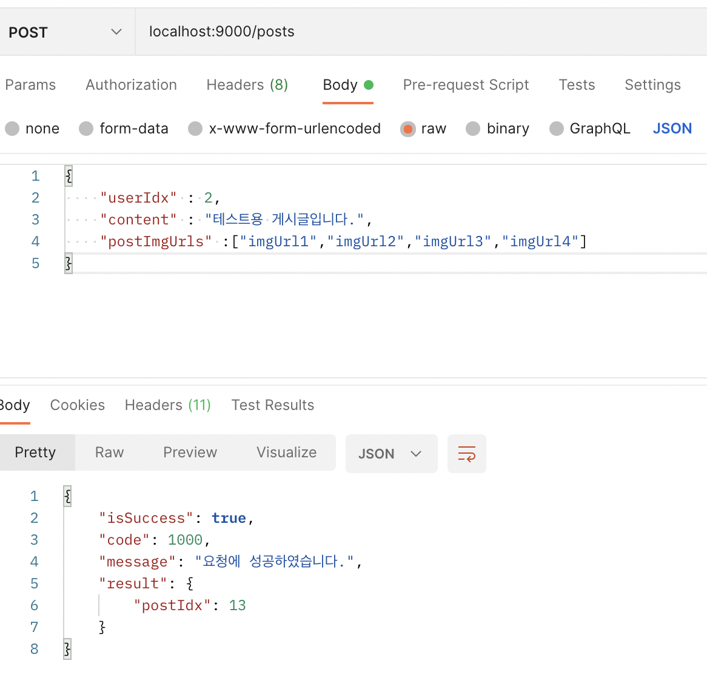

# 9주차
## Notion링크: [Notion](https://www.notion.so/8-4eb70978192e4664b59f9ccf5fd3658d)
## 추가 강의 공부: [Notion](https://cerulean-dew-aac.notion.site/Java-Spring-89db132dc045417685c13917ab7a33ad)

# 1. 게시물 추가(POST Method)

```java
//PostController.java
@ResponseBody
    @PostMapping("") // (POST) 127.0.0.1:9000/posts
    public BaseResponse<PostPostsRes> createPosts(@RequestBody PostPostsReq postPostsReq) {
        try{
            if(postPostsReq.getContent().length() > 450)
            {
                return new BaseResponse<>(BaseResponseStatus.POST_POSTS_INVALID_CONTENTS);
            }
            if(postPostsReq.getPostImgUrls().size()<1){
                return new BaseResponse<>(BaseResponseStatus.POST_POSTS_EMPTY_IMGURL);
            }
            PostPostsRes postPostsRes = postService.createPosts(postPostsReq.getUserIdx(),postPostsReq);
            return new BaseResponse<>(postPostsRes);

        } catch(BaseException exception){
            return new BaseResponse<>((exception.getStatus()));
        }
    }
```

Controller에서는 형식적 validation으로 컨텐츠의 길이가 450자 이하, 이미지가 무조건 1개 이상 입력이 되어야한다.  이후 이러한 validation을 통과하면 Service에 요청을 진행한다.

```java
//PostService.java
public PostPostsRes createPosts(int userIdx, PostPostsReq postPostsReq)throws BaseException{
        try{
            int postIdx = postDao.insertPosts(userIdx,postPostsReq.getContent());
            for (int i=0; i<postPostsReq.getPostImgUrls().size(); i++){
                postDao.insertPostImgs(postIdx,postPostsReq.getPostImgUrls().get(i));
            }
            return new PostPostsRes(postIdx);
        }
        catch(Exception exception){
            throw new BaseException(DATABASE_ERROR);
        }
    }
```

먼저 게시물을 Dao의 insertPosts를 통해 저장을 한 뒤, 받은 postIdx를 외래키로 반복문을 통해 ImgUrl들을 저장한다. 이때 반복문을 통해 이미지(파일)을 DB에 저장하는 것이 마음에 들지않아 다른 방법이 없을까 인터넷에 검색해봤지만, 딱히 마땅한 방법이 존재하지 않았다.

전체 이미지 경로를 String으로 저장한 후 받아올 때 서버에서 문자열 split등의 방식으로 처리해주는 방식을 생각해봤지만, 수정과 같은 부분에서 효율적이지 않을 것이라 판단된다.

```java
//postDao.java
public int insertPosts(int userIdx, String content){
        String insertPostQuery = "INSERT INTO Post(userIdx, content) VALUES (?,?)";
        Object[] insertPostParams = new Object[] {userIdx,content};
        this.jdbcTemplate.update(insertPostQuery,
                insertPostParams);

        String lastInsertIdxQuery="SELECT last_insert_id()";
        return this.jdbcTemplate.queryForObject(lastInsertIdxQuery,int.class);
    }

public int insertPostImgs(int postIdx, PostImgUrlReq postImgUrlReq){
        String insertPostImgsQuery = "INSERT INTO PostImgUrl(postidx, imgUrl) VALUES (?,?)";
        Object[] insertPostImgsParams = new Object[] {postIdx,postImgUrlReq.getImgUrl()};
        this.jdbcTemplate.update(insertPostImgsQuery,
                insertPostImgsParams);
        String lastInsertIdxQuery="SELECT last_insert_id()";
        return this.jdbcTemplate.queryForObject(lastInsertIdxQuery,int.class);
    }
```

InsertPosts의 PostId를 return으로 넘겨주는 건 이미지의 외래키를 위해 주는 것으로 맞다고 생각되지만, insertPostImgs의 return값을 굳이 넘겨주는건 이해가 가지 않는다.

return type을 void로 해도 될 듯하다.




DB에 잘 반영되는 것을 확인할 수 있다.

---

# 2. 게시물 수정(PATCH Method)

```java
//postController.java
@ResponseBody
@PatchMapping("/{postIdx}") // (PATCH) 127.0.0.1:9000/posts/postIdx
public BaseResponse<String> modifyPosts(@PathVariable("postIdx") int postIdx, @RequestBody PatchPostsReq patchPostsReq) {
    try{
        if(patchPostsReq.getContent().length() > 450)
        {
            return new BaseResponse<>(BaseResponseStatus.POST_POSTS_INVALID_CONTENTS);
        }
        postService.modifyPost(patchPostsReq.getUserIdx(),postIdx,patchPostsReq);
        String result = "게시물 수정을 완료했습니다.";
        return new BaseResponse<>(result);

    } catch(BaseException exception){
        return new BaseResponse<>((exception.getStatus()));
    } 
}
```

게시물을 수정하기 위해서는 게시글의 내용만 Body로 받아오면 될 것 같지만, 수정하는 유저가가 게시물 작성자이어야 하므로 인증(session방식, JWT방식 등 )하기 위해 userIdx를 추가로 받아와야한다.

```java
//postService.java
public void modifyPost(int userIdx, int postIdx, PatchPostsReq patchPostsReq)throws BaseException{
        if(postProvider.checkUserExist(userIdx) == 0){
            throw new BaseException(USERS_EMPTY_USER_ID);
        }
        if(postProvider.checkPostExist(postIdx) == 0){
            throw new BaseException(POSTS_EMPTY_POST_ID);
        }
        try{
            int result = postDao.updatePost(postIdx,patchPostsReq.getContent());
            if(result == 0){
                throw new BaseException(MODIFY_FAIL_POST);
            }
        }
        catch(Exception exception){
            throw new BaseException(DATABASE_ERROR);
        }
    }
```

이후 userIdx와 PostIdx가 없다면 예외처리를 시켜준 뒤, Dao를 통해 게시글의 수정내용을 DB에 저장한다.

```java
//postDao.java
public int updatePost(int postIdx, String content){
        String updatePostQuery = "UPDATE Post SET content=? WHERE postIdx=?";
        Object[] updatePostParams = new Object[] {content, postIdx};
        return this.jdbcTemplate.update(updatePostQuery,updatePostParams);
    }
```


---

# 3. 게시물 삭제(PATCH Method)

```java
//postController.java
@ResponseBody
    @PatchMapping("/{postIdx}/status") // (PATCH) 127.0.0.1:9000/posts/postIdx/status
    public BaseResponse<String> deletePosts(@PathVariable("postIdx") int postIdx, @RequestBody DeletePostsReq deletePostsReq) {
        try{
            postService.deletePost(postIdx,deletePostsReq);
            String result = "게시물 삭제를 완료했습니다.";
            return new BaseResponse<>(result);

        } catch(BaseException exception){
            return new BaseResponse<>((exception.getStatus()));
        }
    }
```

강의에서는 게시물 삭제에 UserIdx인증하는 부분이 없지만, 게시물을 삭제하는데 게시물 작성자 본인인 것을 인증해야 삭제가 되도록 만들어야 할 것 같아 개인적으로 추가했다.

```java
//postService.java
public void deletePost(int postIdx, DeletePostsReq deletePostsReq)throws BaseException{
        if(postProvider.checkPostExist(postIdx) == 0){
            throw new BaseException(POSTS_EMPTY_POST_ID);
        }
        if(postProvider.checkUserExist(deletePostsReq.getUserIdx()) == 0){
            throw new BaseException(USERS_EMPTY_USER_ID);
        }
        try{
            int result = postDao.deletePost(postIdx);
            if(result == 0){
                throw new BaseException(DELETE_FAIL_POST);
            }
        }
        catch(Exception exception){
            throw new BaseException(DATABASE_ERROR);
        }
    }
```

게시물 삭제는 게시물 수정과 구조상 같기 때문에 Service부분은 거의 같다.

```java
//postDao.java
public int deletePost(int postIdx){
        String deletePostQuery = "Update Post SET STATUS=? WHERE postIdx=?";
        Object[] deletePostParams = new Object[] {"DELETE",postIdx};
        return this.jdbcTemplate.update(deletePostQuery,deletePostParams);
    }
```

JSON형식에 UserIdx만 넣고 진행을 할시 400에러가 나며 동작되지 않아 억지로 DeletePostReq.java에도 userIdx만 아닌 content항목을 넣어주고 진행했다. 정확하게 에러가 나는 이유는 모르겠다.


