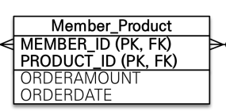

# 10주차

# Notion
https://thuthi.notion.site/UMC-80d96c1f1f3d422ab2f7b80c2322f93f

# JPA PK

다대다 → 다대일 + (중간테이블) + 일대다



DB 공부를 하면 위와 같은 구조가 더 낫다고 한다.

(그림을 강좌에서 들고 왔는데, 인스타그램 클론코딩에서는 Follow Table)


(몇 번째 Follow인지 알 이유가 없음 → 비지니스 로직상 전혀 필요없는 index)

(이 테이블을 조회하기 위해서는 무조건 followerIdx와 followeeIdx가 모두 필요함)

⇒ 실무에서는 조금 껄끄럽다.

(IdClass 만들어서 매핑해야한다.)

**(PK는 비지니스 로직과 관계가 없는게 좋다.)**

**ex)** 회원을 저장할 때 주민등록번호를 같이 저장하는 경우, 어차피 주민등록번호로 회원을 구별할 수 있으니, 주민등록번호를 PK로 잡는 경우가 있다.

개인정보법 개정으로, 주민등록번호를 저장하지 못 하게 되서 테이블 전체를 엎어야하는 일이 발생


따라서, PK는 비지니스 로직상 의미가 없는 값으로, `@GeneratedValue` 로 해주는게 좋다.

---

# 쿠키와 세션, JWT

로그인을 유지시키는 방법

## 쿠키

웹 브라우저에서 한 번 입력한 정보를 계속 입력하지 않아도 되도록 저장하는 저장소.

그냥 웹 브라우저 내부 저장소. 그 이상도 그 이하도 아님. 

특이한 점은, url마다 저장됨. 서로 다른 url끼리 쿠키 교환이나 참조는 불가능함.


### 생성

웹 브라우저에서 웹 서버로 요청을 하면, 서버가 응답을 하면서 데이터를 줌.

### 저장

서버가 준 데이터를 웹 브라우저 내부 저장소에 저장.

### 전송

웹 브라우저에서 웹 서버로 요청을 할 때, 쿠키와 함께 전송함.

### 플라토에 저장된 쿠키


---

## 세션

서버에 저장된 상태 정보. (HTTP는 stateless이므로 요청마다 state를 저장하여 stateful하게 만들어줌. stateless하면 요청이 들어올 때 마다 누가 보낸 요청인지 매번 확인절차를 거쳐야함.)

---

## 세션+쿠키

- 만약 쿠키에 아이디와 비밀번호를 저장해서 로그인을 유지 시킨다면? ⇒ 위 그림과 같이 누구나 볼 수 있고, 공격당할 수 있음.
- 따라서 한 번 로그인을 하면, 서버에서 해당 정보를 저장, 해당 정보를 찾을 수 있는 sessionKey를 쿠키에 담아서 응답으로 반환해줌.
- 웹 브라우저에서는 반환받은 쿠키(with sessionId)를 저장해서 다음 요청부터 sessionId를 전송.
- 서버에서는 sessionId를 보고, 메모리(또는 DB)에서 찾은 뒤, 어떤 사용자인지 판별.
- 쿠키에 아이디와 비밀번호가 아니라 sessionId만 저장되어 있으므로 안전함.

---

## 세션+쿠키의 문제점

1. 만약, 세션정보를 메모리에 저장한다면 사용자가 많아질수록 서버의 메모리 사용량이 늘어남.
2. 메모리에 저장하면, 서버를 확장하여 여러대를 써야할 경우(로드밸런싱 등), 세션 정보를 동기화 시켜주어야함.
3. SQL과 같은 DB에 저장하면 많이 느릴거임.
4. 비록 쿠키에 sessionId만 있으므로 안전하다고 할 지언정, sessionId가 탈취당하면, 탈취한 사람이 로그인을 할 수 있음. (서버는 sessionId로만 사용자를 판별하므로)
5. ~~앱에선 사용불가(라고 할뻔).~~ 쿠키는 http표준임. 다만, 웹 브라우저처럼 자동저장되지는 않음. 확실하지는 않음.

---

## JWT

— 누군가 할 것이므로 생략 —

## JWT의 문제점

- 세션+쿠키와 달리 서버에 저장되지 않으므로 토큰을 탈취당할 경우 강제적으로 연결을 끊어버릴 방법이 없음(로그아웃)
- 따라서, 토큰의 유효기간을 짧게 설정해서 탈취 당하더라도 피해를 최소화할 수 있도록 해야함.
- 근데 유효기간이 너무 짧을 경우, 사용자 입장에서 매우 불편함(30분 마다 로그인을 해줘야함)
- 서버와 통신할 때 마다 토큰 유효기간을 늘려준다고 하더라도, 여전히 불편함(블로그에 글 쓸 때 30분 이상 걸렸는데, 작성 버튼누르면 토큰 만료되서 전부 날라갈 수 있음)

## JWT의 문제점 해결방법

- 인증을 해주는 짧은 유효기간의 ACCESS TOKEN과 ACCCESS TOKEN을 발급해주는 긴 유효기간의 REFRESH TOKEN 총 2개를 발급함.
- 클라이언트에서는 서버로 ACCCESS TOKEN과 REFRESH TOKEN 2개를 전송하고, 서버에서는 ACCESS TOKEN의 유효기간이 만료되면 REFRESH TOKEN을 확인하여 ACCESS TOKEN을 발급하여 로그인을 긴 기간동안 안 해도 되도록 해줌.

### REFRESH TOKEN이 탈취당한다면?

- 탈취한 사용자가 REFRESH TOKEN으로 새 ACCESS TOKEN을 발급받음.
- 근데 기존의 ACCESS TOKEN의 유효기간이 아직 만료되지 않음.
- 탈취한 사용자가 ACCESS TOKEN으로 접근할 경우, 기존의 ACCESS TOKEN이 만료되지 않았으므로 모든 TOKEN을 DROP
- 이렇게 하기 위해서는 ACCESS TOKEN과 REFRESH TOKEN 모두 DB에 저장해놓아야함.( 기존의 ACCESS TOKEN의 유효기간이 만료되지 않음을 판단하기 위해)
- *DB에 저장할거면 그냥 세션이 낫지않나?*

### REFRESH TOKEN과 ACCESS TOKEN 모두 탈취당한다면?

- 방법이 없다.

**⇒ 결론: 완벽한 방법은 존재하지 않는다.**

# SpringSecurity


SpringBoot와 같은, Spring진영의 보안 프레임워크. 기본적으로는 세션 + 쿠키 기반인데, 관련 설정을 off시키고 JWT를 따로 구현하여 사용이 가능함. *(그래서, JWT만 사용할거면 Security를 적용할 이유는 없다)*

## SpringSecurity의 동작위치

### Tomcat


정적 데이터를 반환하는 웹서버와 동적 데이터를 반환하는 웹컨테이너를 모두 포함한 WAS

## SpringSecurity


SpringSecurity는 여러가지 Filter로 이루어져 있고, Filter들이 순서대로 동작한다.

## SpringSecurity의 구조

- Authentication(인증): 접근하는 사람이 누구인지 판별하는 과정
- Authorization(인가): 판별한 사람이 보안 주체에 접근할 수 있는지 판별하는 과정
- Principal(접근 주체): 접근 하는 사람(대상)
- Credential(비밀번호): Principal의 비밀번호


- **SecurityContextHolder**
보안 주체의 세부 정보를 포함하여 프로그램의 현재 보안 상태(컨텍스트) 정보가 저장됨.
- **SecurityContext**
Authentication(인증)을 보관하는 역할을 하며, SecurityContext를 통해서 Authentication 객체를 꺼내올 수 있다.
- **Authentication**
현재 접근하는 주체의 정보와 권한을 담은 인터페이스. Authentication 객체는 SecurityContext에 저장되며, SecurityContextHolder를 통해 SecurityContext에 접근, SecurityContext을 통해 Authentication에 접근할 수 있다.

- **UsernamePasswordAutneticationToken**
Authentication 인터페이스를 구현한 AbstractAuthenticationToken의 하위 클래스로, User의 ID가 Principal이 되고, Password가 Credential역할을 한다. UsernamePasswordAuthenticationToken의 첫번째 생성자는 인증전의 객체를 생성하고, 두번째 생성자는 인증이 완료된 객체를 생성한다.

- **AuthenticationProvider**
인증전의 Authentication객체를 받아서 인증이 완료된 객체를 반환하는, ****실제 인증에 대한 부분 역할을 한다.
- **AuthenticationManager**
AuthenticationProvider를 등록하여 사용하게 해주는 인터페이스

- **UserDetailsService**
**AuthenticationProvider**가 인증에 성공하면 UserDetailsService인터페이스를 통해 UserDetails 객체를 반환함.
- **UserDetails**
**UsernamePasswordAutneticationToken**을 생성하기 위해 사용됨.

# 코드

## User

### UserController

```java
@RestController
@RequestMapping("/api")
public class UserController{
    private final UserService userService;
    @Autowired
    public UserController(UserService userService) {
        this.userService = userService;
    }

    @GetMapping("/hello")
    public ResponseEntity<String> hello() {
        return ResponseEntity.ok("hello");
    }

    @PostMapping("/signup")
    public ResponseEntity<UserDto> signup(
        @Valid @RequestBody UserDto userDto
    ) {
        return ResponseEntity.ok(userService.signup(userDto));
    }

    /**
     * 현재 자신의 정보
     * @param request
     * @return
     */
    @GetMapping("/user")
    @PreAuthorize("hasAnyAuthority('NORMAL','ADMIN')")
    public ResponseEntity<UserDto> getMyUserInfo(HttpServletRequest request) {
        return ResponseEntity.ok(userService.getMyUserWithAuthorities());
    }

    /**
     * 다른 사람의 정보
     * @param username
     * @return
     */
    @GetMapping("/user/{username}")
    @PreAuthorize("hasAnyAuthority('ADMIN')")
    public ResponseEntity<UserDto> getUserInfo(@PathVariable String username) {
        return ResponseEntity.ok(userService.getUserWithAuthorities(username));
    }
}
```

Validation은 `@Valid` 어노테이션으로 간단처리, UserService로 모든 동작을 넘겨줌

`@PreAuthorize` 어노테이션으로 현재 접속한 사용자의 권한에 따라 사용가능여부 제한

### User Service

```java
@Service
public class UserService{
    private final UserRepository userRepository;
    private final PasswordEncoder passwordEncoder;

    @Autowired
    public UserService(UserRepository userRepository, PasswordEncoder passwordEncoder){
        this.userRepository = userRepository;
        this.passwordEncoder = passwordEncoder;
    }

    @Transactional
    public UserDto signup(UserDto userDto) {
        if (userRepository.findOneWithAuthoritiesByEmail(userDto.getEmail()).orElse(null) != null) {
            throw new RuntimeException("이미 가입되어 있는 유저입니다.");
        }

        Authority authority = Authority.builder()
        .authorityName(AuthorityName.NORMAL)
        .build();

        User user = User.builder()
        .email(userDto.getEmail())
        .password(passwordEncoder.encode(userDto.getPassword()))
        .nickname(userDto.getNickname())
        .authorities(Collections.singleton(authority))
        .build();

        return UserDto.from(userRepository.save(user));
    }

    @Transactional(readOnly = true)
    public UserDto getUserWithAuthorities(String email) {
        return UserDto.from(userRepository.findOneWithAuthoritiesByEmail(email).orElse(null));
    }

    @Transactional(readOnly = true)
    public UserDto getMyUserWithAuthorities() {
        return UserDto.from(SecurityUtil.getCurrentEmail().flatMap(userRepository::findOneWithAuthoritiesByEmail).orElse(null));
    }
}
```

- `signup` : 이미 가입된 이메일인지 확인 후, `Authority(권한)` 를 NORMAL로 설정해서 User 객체 생성. password는 PasswordEncoder라는 객체로 인코딩해서 저장.
- `getMyUserWithAuthorities` : **SecurityUtil이라는 객체로 현재 로그인된 유저의 email을 가져와서 email에 맞는 유저 정보 가져옴.**
- `getUserWithAuthorities` : 입력으로 들어온 email에 맞는 유저 정보를 가져옴.

### User Repository

```java
@Repository
public interface UserRepository extends JpaRepository<User, Long> {
    @EntityGraph(attributePaths = "authorities")
    Optional<User> findOneWithAuthoritiesByEmail(String email);
}
```

Spring Data JPA로 간단하게 구현.

`@EntityGraph` 어노테이션은 알아서 Join해서 가져와주는 역할.

### User, Authority, AuthorityName model

```java
public class User {
    @Id
    @Column(name = "user_id")
    @GeneratedValue
    private Long userId;

    @Column(unique = true)
    private String email;

    @Column(length = 100)
    private String password;

    @Column(length = 50)
    private String nickname;

    @ManyToMany
    @JoinTable(
    name = "user_authority",
    joinColumns = {@JoinColumn(name = "user_id", referencedColumnName = "user_id")},
    inverseJoinColumns = {@JoinColumn(name = "authority_name", referencedColumnName = "authority_name")})
    private Set<Authority> authorities;
}

public class Authority {
    @Id
    @Enumerated(EnumType.STRING)
    @Column(name = "authority_name")
    private AuthorityName authorityName;
}

public enum AuthorityName{
    NORMAL,
    ADMIN,
    ROOT
}
```


- `@ManyToMany` : 다대다 관계를 알아서 일대다 - 다대일 관계로 풀어줌. (절대 쓰면 안 되나, JPA공부가 아니므로 패스)

여기까지는 “**SecurityUtil이라는 객체로 현재 로그인된 유저의 email을 가져와서 email에 맞는 유저 정보 가져옴.”** 를 제외하고는 UDEMY강좌로 해온 작업과 거의 유사함. 이제 이 SecurityUtil을 만들어줘야함.

### SecurityUtil

```java
public class SecurityUtil{
    private static final Logger logger = LoggerFactory.getLogger(SecurityUtil.class);
    public static Optional<String> getCurrentEmail() {
        final Authentication authentication = SecurityContextHolder.getContext().getAuthentication();

        if (authentication == null) {
            logger.debug("Security Context에 인증 정보가 없습니다.");
            return Optional.empty();
        }

        String email = null;
        if (authentication.getPrincipal() instanceof UserDetails) {
            UserDetails springSecurityUser = (UserDetails) authentication.getPrincipal();
            email = springSecurityUser.getUsername();
        } else if (authentication.getPrincipal() instanceof String) {
            email = (String) authentication.getPrincipal();
        }

        return Optional.ofNullable(email);
    }
}
```

- `getCurrentEmail` : 현재 접속한 유저의 이메일 정보를 가져오는 함수.


```java
final Authentication authentication = SecurityContextHolder.getContext().getAuthentication();
```

SecurityContextHolder안의 SecurityContext에서 Authentication을 가져옴.

만약 로그인이 되어 있지 않다면 Authentication이 null임.

## Auth

### AuthController

```java
@RestController
@RequestMapping("/api")
public class AuthController{
    private final TokenProvider tokenProvider;
    private final AuthenticationManagerBuilder authenticationManagerBuilder;

    @Autowired
    public AuthController(TokenProvider tokenProvider, AuthenticationManagerBuilder authenticationManagerBuilder){
        this.tokenProvider = tokenProvider;
        this.authenticationManagerBuilder = authenticationManagerBuilder;
    }

    @PostMapping("/login")
    public ResponseEntity<TokenDto> login(
        @Valid @RequestBody LoginDto loginDto
    ) {
        UsernamePasswordAuthenticationToken usernamePasswordAuthenticationToken = new UsernamePasswordAuthenticationToken(loginDto.getEmail(), loginDto.getPassword());

        Authentication authentication = authenticationManagerBuilder.getObject().authenticate(usernamePasswordAuthenticationToken);
        //SecurityContextHolder.getContext().setAuthentication(authentication);

        String jwt = tokenProvider.createToken(authentication);

        HttpHeaders httpHeaders = new HttpHeaders();
        httpHeaders.add(JwtFilter.AUTHRIZATION_HEADER, "Bearer " + jwt);
        return new ResponseEntity<TokenDto>(new TokenDto(jwt), httpHeaders, HttpStatus.OK);
    }
}
```

- `TokenProvider`: JWT를 생성, 검증해주는 객체. Udemy 강좌와 비슷한 로직을 가짐.
- `UsernamePasswordAuthenticationToken` : Framework에 내장된 username과 password로 인증하는 토큰. `Authentication` 객체를 만들기 위해 사용됨.

## Filter

### JwtFilter

```java
public class JwtFilter extends GenericFilterBean {
    private static final Logger logger = LoggerFactory.getLogger(JwtFilter.class);
    public static final String AUTHORIZATION_HEADER = "Authorization";
    private TokenProvider tokenProvider;

    public JwtFilter(TokenProvider tokenProvider) {
        this.tokenProvider = tokenProvider;
    }

    @Override
    public void doFilter(ServletRequest servletRequest, ServletResponse servletResponse, FilterChain filterChain)
    throws IOException, ServletException {
        HttpServletRequest httpServletRequest = (HttpServletRequest) servletRequest;
        String jwt = resolveToken(httpServletRequest);
        String requestURI = httpServletRequest.getRequestURI();

        if (StringUtils.hasText(jwt) && tokenProvider.validateToken(jwt)) {
            Authentication authentication = tokenProvider.getAuthentication(jwt);
            SecurityContextHolder.getContext().setAuthentication(authentication);
            logger.debug("Security Context에 '{}' 인증 정보를 저장했습니다, uri: {}", authentication.getName(), requestURI);
        } else {
            logger.debug("유효한 JWT 토큰이 없습니다, uri: {}", requestURI);
        }

        filterChain.doFilter(servletRequest, servletResponse);
    }

    private String resolveToken(HttpServletRequest request) {
        String bearerToken = request.getHeader(AUTHORIZATION_HEADER);
        if (StringUtils.hasText(bearerToken) && bearerToken.startsWith("Bearer ")) {
            return bearerToken.substring(7);
        }
        return null;
    }
}
```

사실상의 핵심 코드.

요청이 들어오면 `doFilter` 메소드가 실행되어 현재 요청에 담겨져 있는 JWT 정보를 확인/분석해서 `SecurityContext`에 `Authentication` 객체 형태로 담아둠.

## 로그인 시나리오(JWT가 없는 요청)


## 시나리오(JWT가 있는 요청)


## 그 외 코드들

### UserDetailsServiceImpl

```java
@Component("userDetailsService")
public class UserDetailsServiceImpl implements UserDetailsService{
    private final UserRepository userRepository;

    public UserDetailsServiceImpl(UserRepository userRepository) {
        this.userRepository = userRepository;
    }

    @Override
    @Transactional
    public UserDetails loadUserByUsername(final String email) {
        return userRepository.findOneWithAuthoritiesByEmail(email)
        .map(user -> createUser(email, user))
        .orElseThrow(() -> new UsernameNotFoundException(email + " -> 데이터베이스에서 찾을 수 없습니다."));
    }

    private org.springframework.security.core.userdetails.User createUser(String email, User user) {
        List<GrantedAuthority> grantedAuthorities = user.getAuthorities().stream()
            .map(authority -> new SimpleGrantedAuthority(authority.getAuthorityName().name()))
            .collect(Collectors.toList());

        return new org.springframework.security.core.userdetails.User(user.getEmail(),
        user.getPassword(),
        grantedAuthorities);
    }
}
```

Spring Security 내부적으로 동작하는 Service. UserDetails라는 dto로 유저 정보를 가져와 Authentication을 만드는데 사용.

### CorsConfig

```java
@Configuration
public class CorsConfig {

    @Bean
    public CorsFilter corsFilter() {
        UrlBasedCorsConfigurationSource source = new UrlBasedCorsConfigurationSource();
        CorsConfiguration config = new CorsConfiguration();
        config.setAllowCredentials(true);
        config.addAllowedOrigin("*");
        config.addAllowedHeader("*");
        config.addAllowedMethod("*");

        source.registerCorsConfiguration("/api/**", config);
        return new CorsFilter(source);
    }

}
```

CORS 설정을 간편하게 해주는 CorsFilter를 Bean에 등록하는 설정파일.

### JwtSecurityConfig

```java
public class JwtSecurityConfig extends SecurityConfigurerAdapter<DefaultSecurityFilterChain, HttpSecurity>{

    private TokenProvider tokenProvider;

    public JwtSecurityConfig(TokenProvider tokenProvider) {
        this.tokenProvider = tokenProvider;
    }

    @Override
    public void configure(HttpSecurity http) {
        JwtFilter customFilter = new JwtFilter(tokenProvider);
        http.addFilterBefore(customFilter, UsernamePasswordAuthenticationFilter.class);
    }
}
```

`JwtFilter`를 `UsernamePasswordAuthenticationFilter` 앞에 붙히기 위해 설정하는 Config파일. 적용은 @Configure이 아니라 `SecurityConfig.java`에서 적용한다.

### SecurityConfig

```java
@EnableWebSecurity
@EnableGlobalMethodSecurity(prePostEnabled = true)
public class SecurityConfig extends WebSecurityConfigurerAdapter {
    private final TokenProvider tokenProvider;
    private final CorsFilter corsFilter;
    private final JwtAuthenticationEntryPoint jwtAuthenticationEntryPoint;
    private final JwtAccessDeniedHandler jwtAccessDeniedHandler;

    public SecurityConfig(
    TokenProvider tokenProvider,
    CorsFilter corsFilter,
    JwtAuthenticationEntryPoint jwtAuthenticationEntryPoint,
    JwtAccessDeniedHandler jwtAccessDeniedHandler
    ) {
        this.tokenProvider = tokenProvider;
        this.corsFilter = corsFilter;
        this.jwtAuthenticationEntryPoint = jwtAuthenticationEntryPoint;
        this.jwtAccessDeniedHandler = jwtAccessDeniedHandler;
    }

    @Bean
    public PasswordEncoder passwordEncoder() {
        return new BCryptPasswordEncoder();
    }

    @Override
    public void configure(WebSecurity web) {
        web.ignoring()
        .antMatchers(
        "/h2-console/**"
        ,"/favicon.ico"
        ,"/error"
        );
    }

    @Override
    protected void configure(HttpSecurity httpSecurity) throws Exception {
        httpSecurity
        // token을 사용하는 방식이기 때문에 csrf를 disable합니다.
        .csrf().disable()

        .addFilterBefore(corsFilter, UsernamePasswordAuthenticationFilter.class)

        .exceptionHandling()
        .authenticationEntryPoint(jwtAuthenticationEntryPoint)
        .accessDeniedHandler(jwtAccessDeniedHandler)

        // enable h2-console
        .and()
        .headers()
        .frameOptions()
        .sameOrigin()

        // 세션을 사용하지 않기 때문에 STATELESS로 설정
        .and()
        .sessionManagement()
        .sessionCreationPolicy(SessionCreationPolicy.STATELESS)

        .and()
        .authorizeRequests()
        .antMatchers("/api/hello").permitAll()
        .antMatchers("/api/login").permitAll()
        .antMatchers("/api/signup").permitAll()

        .anyRequest().authenticated()

        .and()
        .apply(new JwtSecurityConfig(tokenProvider));
    }
}
```

- CSRF disable
- 빈에 등록된 CorsFilter를 등록
- `jwtAuthenticationEntryPoint` 와 `jwtAccessDeniedHandler` 라는 ExceptionHandler를 등록(사용자 정의 객체임)
- h2(DB) 등록 *(왜 필요한지 몰?루)*
- Stateless 설정 *(왜 필요한지 몰?루)*
- JWT없이 접근할 수 있는 api들 등록 (없으면 JWT없이 요청 시 에러남)
- JwtFilter를 적용하는 JwtSecurityConfig 등록
- PasswordEncryption을 위한 `PasswordEncoder` 를 Bean에 등록

# 적용 결과

## 회원가입


## 로그인(정상)


## 로그인(실패)


## API요청(권한이 있는 경우)


## API요청(권한이 없는 경우)


## API요청(Token이 만료된 경우)


# Spring Security 적용후기

- JWT를 쓸거면 쓸 이유가 없어보임.
- 구조가 굉장히 복잡하기 때문에 오히려 복잡도가 더 높아지는 것 같음.
- 이해와 적용에만 3일이 넘게 걸림.
- 다만, 한번 적용해 놓으면 비니지스 로직에선 신경쓸게 없어짐.

# 개선사항

- UserSerivce와 UserDetailsServiceImpl을 합칠 수 있음
- UserDetails를 상속받는 UserDto를 만들어서 Dto를 통일할 수 있음(구조가 거의 비슷함)
- ACCESS TOKEN뿐 아니라 REFRESH TOKEN을 발급하는 api도 만들어야함.