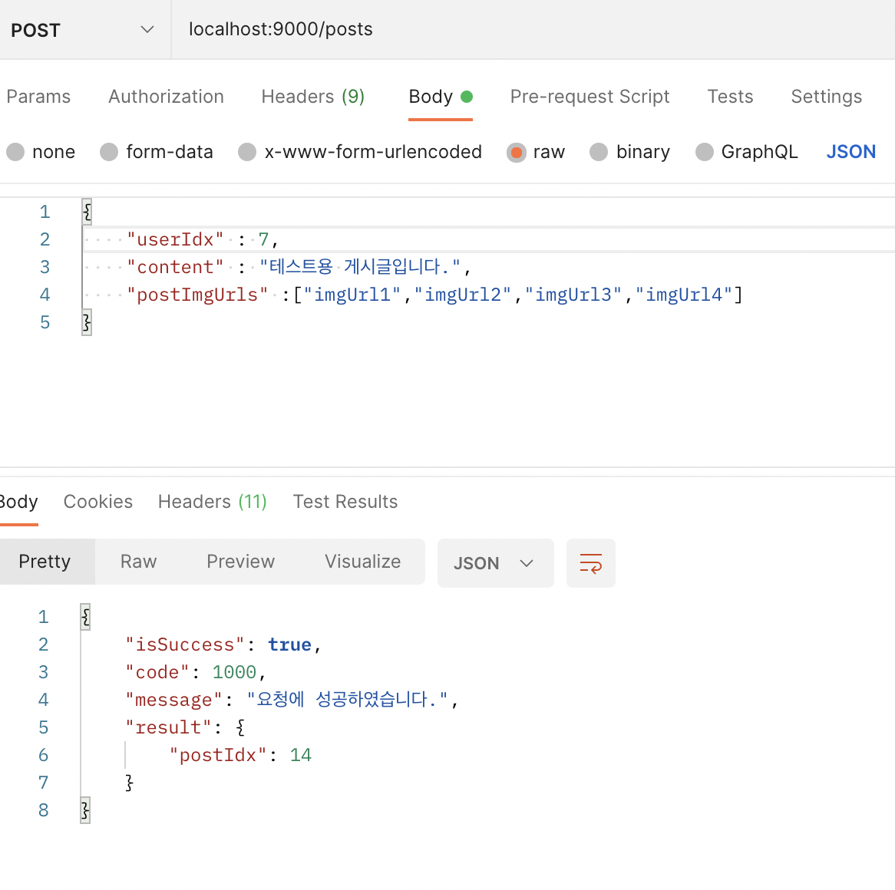

# 10주차
## Notion링크: [Notion](https://cerulean-dew-aac.notion.site/10-6282d01412b84b92a4d00d6909057430)
## 추가 강의 공부: [Notion](https://cerulean-dew-aac.notion.site/8-AOP-87cba2ee3fb04c17a558dab2409c1629)
-------------------------
# 강의 내용(실습)

## JWT
JWT사용에 관해서는 기존에 제공하는 템플릿에 다 제공을 했기에 그냥 따라만 했다. 실제로는 JWT를 Spring Security와 함께 사용한다고 한다.

## 로그인

`AuthContoller.java`

```java
@ResponseBody
    @PostMapping("/logIn") // (PATCH) 127.0.0.1:9000/
    public BaseResponse<PostLoginRes> logIn(@RequestBody PostLoginReq postLoginReq){
        try {
            if(postLoginReq.getWebsite() == null){
                return new BaseResponse<>(POST_USERS_EMPTY_EMAIL);
            }

            if(postLoginReq.getPassword() == null){
                return new BaseResponse<>(POST_USERS_EMPTY_PASSWORD);
            }
            if(!isRegexEmail(postLoginReq.getWebsite())){
                return new BaseResponse<>(POST_USERS_INVALID_EMAIL);
            }

            PostLoginRes postLoginRes = authService.logIn(postLoginReq);

            return new BaseResponse<>(postLoginRes);

        } catch (BaseException exception) {
            return new BaseResponse<>((exception.getStatus()));
        }
    }
```

`AuthService.java`

```java
public PostLoginRes logIn(PostLoginReq postLoginReq) throws BaseException {
        User user = authDao.getPwd(postLoginReq);
        String encryptPwd;
        try{
            //암호화
            encryptPwd = new SHA256().encrypt(postLoginReq.getPassword());
        } catch (Exception exception) {
            throw new BaseException(PASSWORD_ENCRYPTION_ERROR);
        }

        if(user.getPassword().equals(encryptPwd)){
            int userIdx = user.getUserIdx();
            String jwt = jwtService.createJwt(userIdx);
            return new PostLoginRes(userIdx,jwt);
        }
        else{
            throw new BaseException(FAILED_TO_LOGIN);
        }
    }
```

`AuthDao.java`

```java
public User getPwd(PostLoginReq postLoginReq){
        String getPwdQuery = "select userIdx, nickName, name, website,  password from User where website=?";
        String getPwdParams = postLoginReq.getWebsite();

        return this.jdbcTemplate.queryForObject(getPwdQuery,
                (rs,rowNum)-> new User(
                        rs.getInt("userIdx"),
                        rs.getString("nickName"),
                        rs.getString("name"),
                        rs.getString("website"),
                        rs.getString("password")
                ),
                getPwdParams);
    }
```

## 게시물 작성 및 수정 추가

### 게시물 작성

`postController.java`

```java
@ResponseBody
    @PostMapping("") // (POST) 127.0.0.1:9000/posts
    public BaseResponse<PostPostsRes> createPosts(@RequestBody PostPostsReq postPostsReq) {
        try{
            int userIdxByJwt = jwtService.getUserIdx();
            if(postPostsReq.getUserIdx()!=userIdxByJwt){
                return new BaseResponse<>(BaseResponseStatus.INVALID_USER_JWT);
            }
            if(postPostsReq.getContent().length() > 450)
            {
                return new BaseResponse<>(BaseResponseStatus.POST_POSTS_INVALID_CONTENTS);
            }
            if(postPostsReq.getPostImgUrls().size()<1){
                return new BaseResponse<>(BaseResponseStatus.POST_POSTS_EMPTY_IMGURL);
            }
            PostPostsRes postPostsRes = postService.createPosts(postPostsReq.getUserIdx(),postPostsReq);
            return new BaseResponse<>(postPostsRes);

        } catch(BaseException exception){
            return new BaseResponse<>((exception.getStatus()));
        }
    }
```

<aside>
💡 게시물 수정 및 삭제또한 단순하게 jwt비교만 넣으면 되기에 코드는 생략한다.

</aside>




---

# 추가 공부

# 1. 인증 방식(이론)

현재 우리가 사용하는 대부분의 서비스는 로그인과 같은 사용자를 인증하는 방식을 채택한다.

사용자 입장에서는 ID와 비밀번호를 입력만 하면 로그인이 되지만,  백엔드(서버)측에서는 보안, 인증유지기간 등의 이유로 그렇게 간단하게 동작되지는 않는다.

## [1] 단순한 방식(ID, PW 방식)

가장 기본이 되는 인증 방식. 대부분 Password를 암호화하여 DB와 대조하는 방식으로 사용된다.

제 3자에 의해 탈취당했을 때 개인정보가 드러나기 때문에 보안에 좋지 않은 방식

(코드짜기는 편하겠지만, 쓰면 안된다.)

## [2] Cookie/Session

로그인 과정에서만 계정 정보를 서버에 직접 보내고, 그 후로는 세션과 쿠키를 활용하여 인증하는 방식이다..


출처 : https://tansfil.tistory.com/58

### 인증하는 단계

1. 인증되지 않은 사용자가 서버에 로그인 계정 정보를 보낸다.
2. 서버는 전달 받은 계정 정보를 통해 DB를 조회하여 사용자를 확인한다.
3. 서버는 세션 스토리지에 세션을 생성한다.
4. 서버는 세션 스토리지로 부터 세션ID를 발급받는다.
5. 서버는 클라이언트에게 세션ID를 포함하여 응답 메시지를 보낸다. 사용자는 전달받은 세션ID를 쿠키에 저장한다.
6. 사용자는 이후의 요청에 발급받은 쿠키를 포함하여 서버로 보낸다.
7. 서버는 쿠키를 통해 세션ID를 얻은 후 세션 스토리지로부터 세션을 얻는다.
8. 서버는 얻어진 세션을 바탕으로 요청 데이터를 찾아서 사용자에게 응답한다.

### 장점

1. 세션ID는 유의미한 값을 갖지 않아서 HTTP 헤더나 바디에 직접 계정정보를 담아 전송하는 것보다는 보안에 뛰어나다.

2. 세션ID는 고유의 ID값이기 때문에 서버 메모리에서 바로 검색할 수 있어 성능 향상을 기대할 수 있다.

### 단점

1. 가로챈 쿠키 즉, 세션 ID를 가지고 해커가 동일한 요청을 보낼 경우 진짜 사용자인지 해커인지 구분 할 수 없다.
**위와 같은 단점을 보완하기 위해선 세션 유효시간을 짧게 설정하고, HTTPS 프로토콜을 사용하여야 함**

2. 세션 스토리지는 별도의 메모리를 사용하기 때문에 동시 사용자가 많을 수록 서버에 부하가 생길 가능성이 있다.

3. **분산형 DB를 사용할 경우 세션처리가 힘들다. 아래 링크에 자세하게 설명해주지만 간단하게 요약하면 다음과 같다.**

[[#1] 분산 서버 환경의 세션 정합성 관리](https://souljit2.tistory.com/71)

자세한건 링크 참조


사용자가 로그인을 성공하고 로드 밸런서를 통해 서버1에 세션을 저장한다고 가정하자.

로그인 성공 처리를 한 후 앱이나 웹에서 서비스를 사용한다고 하면 대부분의 서비스가 사용자 인증(세션)을 요구할 것이다.

이때 만약 서비스 요청을 로드 밸런서가 서버2로 연결해 줄 경우 서버2에는 세션이 저장되어있지 않기에 세션 인증이 실패하는 현상이 발생한다.

이런 현상을 막기 위해 Sticky Session, Session Clustering, In-Memory Database기법 등이 존재하지만, 각각 단점들이 결국 존재한다.

## [3] Token

인증받은 사용자들에게 토큰을 발급하고, 서버에 요청을 할 때 헤더에 토큰을 함께 보내도록 하여 유효성 검사를 한다.

이러한 시스템에서는 더이상 사용자의 인증 정보를 서버나 세션에 유지하지 않고 클라이언트 측에서 들어오는 요청만으로 작업을 처리한다. 

즉, 서버 기반의 인증 시스템과 달리 상태를 유지하지 않으므로 Stateless한 구조를 갖는다.


토큰 인증방식

### 장점

- 무상태성(Stateless) & 확장성(Scalability)
    
    토큰은 클라이언트 측에 저장되기 때문에 서버는 완전히 Stateless하며, 클라이언트와 서버의 연결고리가 없기 때문에 확장하기에 매우 적합하다.
    
    만약 사용자 정보가 서버 측 세션에 저장된 경우에 서버를 확장하여 분산처리 한다면, 해당 사용자는 처음 로그인 했었던 서버에만 요청을 받도록 설정을 해주어야 한다.
    
    하지만 토큰을 사용한다면 어떠한 서버로 요청이 와도 상관이 없다.
    
- 보안성
    
    클라이언트가 서버로 요청을 보낼 때 더 이상 쿠키를 전달하지 않으므로, 쿠키 사용에 의한 취약점이 사라지게 된다. 
    
    하지만 토큰 환경의 취약점이 존재할 수 있으므로 이에 대비해야 한다.
    
- 확장성(Extensibility)
    
    시스템의 확장성을 의미하는 Scalability와 달리 Extensibility는 로그인 정보가 사용되는 분야의 확정을 의미한다.
    
    토큰 기반의 인증 시스템에서는 토큰에 선택적인 권한만 부여하여 발급할 수 있으며 OAuth의 경우 Facebook, Google 등과 같은 소셜 계정을 이용하여 다른 웹서비스에서도 로그인을 할 수 있다.
    
- 여러 플랫폼 및 도메인
    
    서버 기반 인증 시스템의 문제점 중 하나인 CORS를 해결할 수 있는데, 애플리케이션과 서비스의 규모가 커지면 여러 디바이스를 호환시키고 더 많은 종류의 서비스를 제공하게 된다. 토큰을 사용한다면 어떤 디바이스, 어떤 도메인에서도 토큰의 유효성 검사를 진행한 후에 요청을 처리할 수 있다. 이런 구조를 통해 assests 파일(Image, html, css, js 등)은 모두 CDN에서 제공하고, 서버 측에서는 API만 다루도록 설게할 수 있다.
    

현재는 Json 포맷을 이용하는 JWT(Json Web Token)을 가장 많이쓰고, 소셜로그인에서는 OAuth를 사용한다.

 

---

# JWT(Json Web Token)

JWT는 header.payload.signature 로 이루어져 있다.  . 을 구분자로 사용한다.


### [1] **header**

토큰의 타입(type)과 해싱 알고리즘(alg)을 지정해준다. 

해싱 알고리즘으로는 보통 HMAC SHA256 혹은 RSA 가 사용되며, 이 알고리즘은, 토큰을 검증 할 때 사용되는 signature 부분에서 사용된다.

```jsx
{ 
 "alg": "HS256",
 "typ": JWT
}
```

### [2] **Payload**

토큰에 담을 정보

- 토큰은 클레임으로 이루어져 있으며 name / value 쌍으로 이루어진다. 
클레임 의 종류는 다음과 같이 크게 세 분류로 나뉜다.
1. registered claim: 서비스에 필요한 정보가 아니라 토큰에 대한 정보들을 담기위해 이름이 이미 정해진 claim
    - iss : 토큰 발급자
    - sub : 토큰 제목 (subject)
    - aud : 토큰 대상자 (audience)
    - exp : 토큰의 만료시간 시간은 NumericDate 형식으로 해야 하며 언제나 현재 시간보다 이후로 설정해야 한다. (예: 1480849147370)
    - nbf : Not Before 를 의미하며, 토큰의 활성 날짜와 비슷한 개념이다. 여기에도 NumericDate 형식으로 날짜를 지정하며, 이 날짜가 지나기 전까지는 토큰이 처리되지 않는다.
    - iat : 토큰이 발급된 시간 (issued at), 이 값을 사용하여 토큰의 age가 얼마나 되었는지 판단 할 수 있다.
    - jti : JWT의 고유 식별자로서, 주로 중복적인 처리를 방지하기 위하여 사용됩니다. 일회용 토큰에 사용하면 유용하다.

1. public claim : 충돌을 방지된 이름을 가지고 있어야 하며 이를 위해 URI 형식으로 이름을 짓는다.

```jsx
{
   "https://velopert.com/jwt_claims/is_admin": true
}
```

1. private claim: 양 측간에 (Client <->Server) 협의하에 사용되는 클레임 이름들입니다. 공개 클레임과는 달리 이름이 중복되어 충돌이 될 수 있으니 사용할때에 유의해야합니다.

```jsx
{
"username": "velopert"
}
```

종합 예시를 들면

```jsx
{
  "iss": "gorokke.com",
  "exp": "1485270000000",
  "https://gorokke.com/jwt_claims/is_admin": true,
  "userId": "11028373727102",
  "username": "gorokke"
}
```

2개의 registered claim, 1개의 public claim, 2개의 private claim

### [3] **Signature**

- 서명(Signature)은 토큰을 인코딩하거나 유효성 검증을 할 때 사용하는 고유한 암호화 코드이다.서명(Signature)은 위에서 만든 헤더(Header)와 페이로드(Payload)의 값을 각각 BASE64로 인코딩하고, 인코딩한 값을 비밀 키를 이용해 헤더(Header)에서 정의한 알고리즘으로 해싱을 하고, 이 값을 다시 BASE64로 인코딩하여 생성한다.

최종적으로는 다음과 같은 형식이 된다.

```jsx
jwt = encodedHeader.encodedPayload.signature
```

---

# OAuth

> 자신이 소유한 리소스에 소프트웨어 애플리케이션이 접근할 수 있도록 허용해 줌으로써 접근 권한을 위임해주는 개방형 표준 프로토콜
즉 내가 만든 로그인 시스템에 카카오 로그인 기능을 추가할 수 있다.
> 

[[OAuth] OAuth2.0란?](https://doqtqu.tistory.com/295)

자세한 건 링크 참조